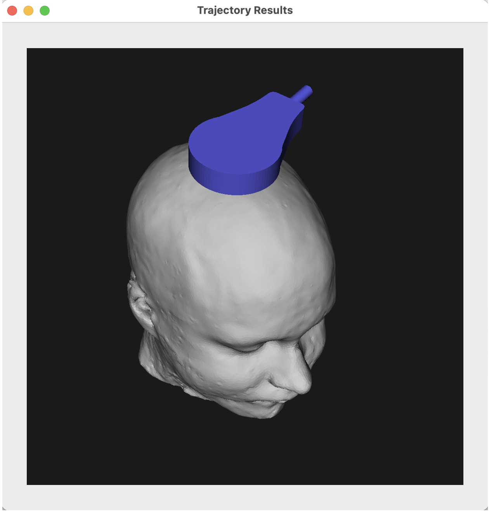
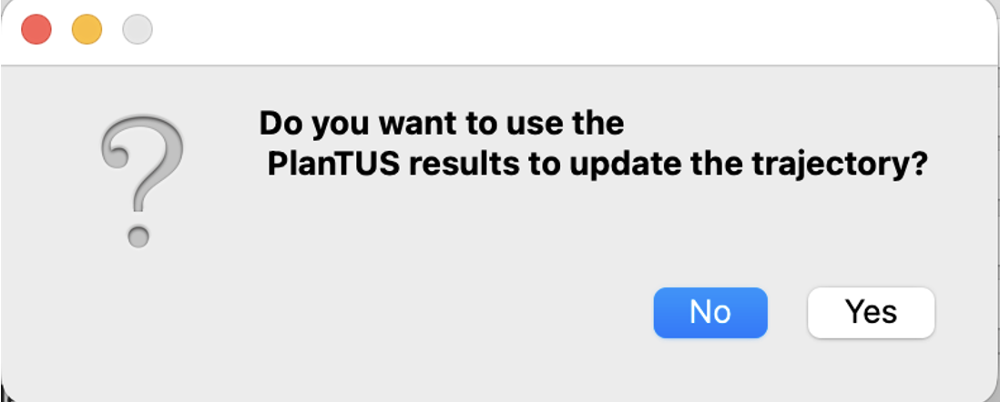

PlanTUS integration 
-----
Starting in r0.8.0, there is an experimental feature to integrate with the excellent tool [PlanTUS](https://doi.org/10.1016/j.brs.2025.08.013) developed by Maximilian Lueckel, Suhas Vijayakumar and Til Ole Bergmann from Mainz University that helps to refine trajectories using heatmaps of incident angles, distance, degree of intersection and skin-skull angle.


This procedure in BabelBrain can update the trajectory defined originally in 3DSlicer or Brainsight to improve, for example, incident angle.

# Limitations
* Operational to most devices excepting generic simple single element transducers; BSonix devices are supported (to be improved in future release). Currently, operation with single element devices will not produce a correct result.
* Because some dependencies, only macOS and Linux are currently supported (to be improved in future release).
* Multiple dependencies to external libraries (dependencies to be reduced in future release)

In macOS and if using the binary distribution, it is recommended to run from the terminal to identify error messages during the execution that otherwise are not yet captured in the BabelBrain log window. For example

```bash
/Applications/BabelBrain.app/Contents/MacOS/BabelBrain 
```

# Requirements
In this initial integration, the integration needs the following extra packages:

* [FSL](https://fsl.fmrib.ox.ac.uk/fsl/docs/).
* [Workbench connectome](https://humanconnectome.org/software/connectome-workbench). If on macOS **Download the [zip version of version 2.0.1](https://humanconnectome.org/storage/app/media/workbench/workbench-macub-v2.0.1.zip). DO NOT DOWNLOAD the DMG version as currently that version is not properly signed and macOS will refuse to run it**.
* [Freesurfer](https://surfer.nmr.mgh.harvard.edu). Tested with version 7.4.1.
* [PlanTUS fork](https://github.com/spichardo/PlanTUS) needed to automate tasks.

Download all the tools above and take note of paths for PlanTUS fork location and binary files of FSL, Workbench (location of `wb_command` binary) and Freesurfer.

Take also note of path to SimNIBS root path; for example `/Users/spichardo/Applications/SimNIBS-4.5`.

## Extra libraries in SimNIBS environment
Activate SimNIBS Python environment, for example:
```bash
source <path_to_SimNIBS_root>/simnibs_env/bin/activate
```
Install extra libraries with
```bash
pip install nilearn btk pynput
```

## Execution of PlanTUS
* Define location in Brainsight/Slicer and export trajectory/linear transformation.
* Do not worry to adjust the trajectory manually as is usually done, as we expect to use the one calculated with PlanTUS. Just focus on the **target location**.


* Specify paths to tools in the Advanced Dialog


* These paths will remain saved between BabelBrain sessions.

* Click on `RUN PlanTUS` button. Execution will take only a couple of minutes. If all paths are correctly set, a multiple view window will show different heatmaps as below:


* All views are linked to inspect all heatmaps simultaneously (similar as in connectome workbench).

* Click on “Selection Mode” and select a feasible location on the head’s surface. For example, one that minimizes incident angle. A small spherical marker will appear on the selected location as shown below


* Click on `Click on Generate Trajectory`.
* A visualization of the transducer at the selected location will be shown




* When closing this window, a prompt will appear asking to update the target definition



* When running Step 1 in BabelBrain, you will see the new trajectory is the one selected with PlanTUS. 


* This trajectory will be saved in the same directory as the original with the “_PlanTUS” suffix added in the filename


