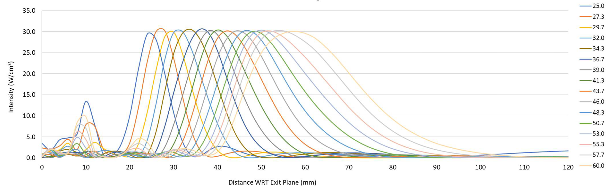
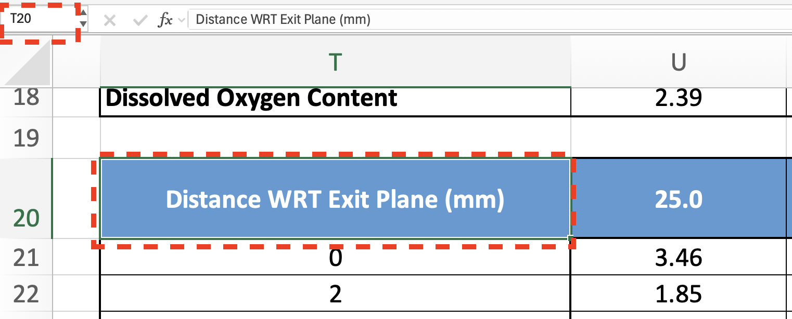
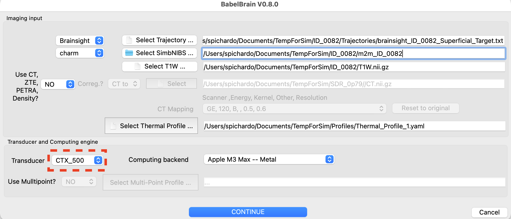
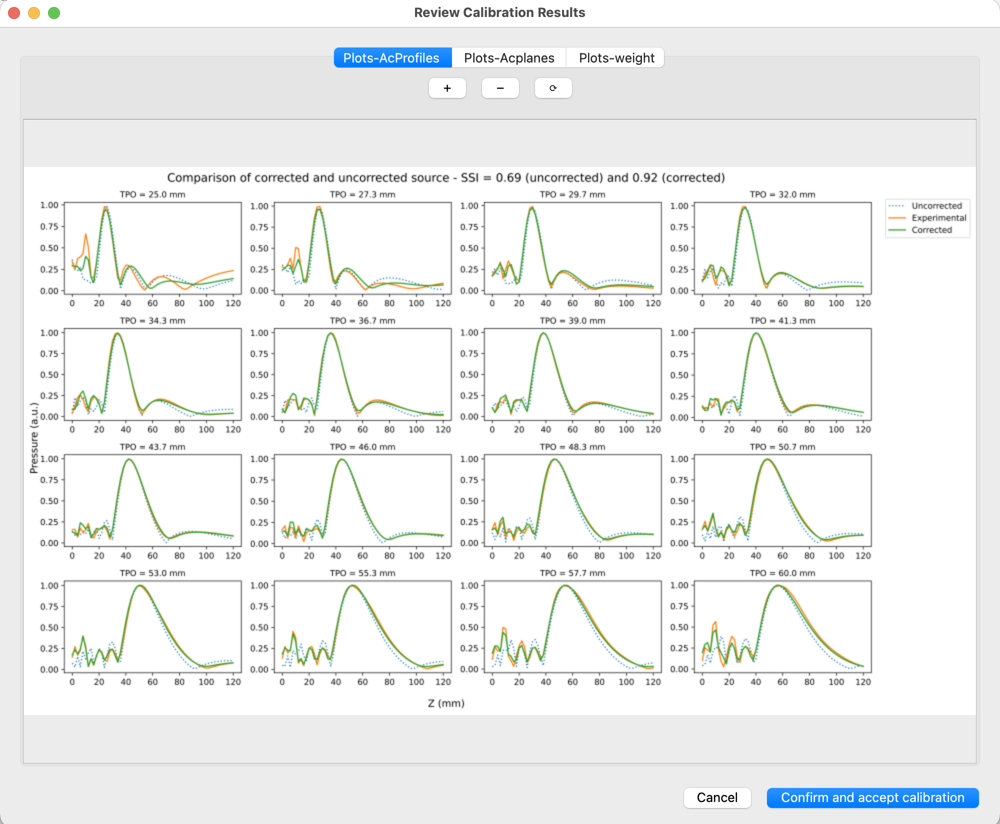

Transducer calibration 
-----
Starting in r0.8.0, there is the possibility to calibrate ring-type devices such as the CTX-500 and similar based on the reported **intensity** data on axial steering. For example, most reports show an as the one below detailing the steering capabilities of the device:



This procedure in BabelBrain enables the modelling the specific response of individual transducers, improving precision of simulations.

# Requirements
Obtain from the vendor an Excel file with the intensity profile data used to produce the intensity report shown above, for example:


# Procedure
## 1. Identify range of data
Identify the range of cells for intensity data needed to produce the plot. The selected table should contain the Z axis distance from the outplane in the first column and the intensity values in the next columns corresponding to each steering in Z. 

On the example above, the first cell would be **T20**:



and the last cell would be **AJ81**:


**VERY IMPORTANT**: Be sure of selecting the cell matching the last steering condition at the deepest Z value, **and nothing else**.
## 2. Prepare YAML file with input information for calibration
Details of the Excel sheet and cell range is specified via a simple YAML file as the one shown below

```YAML
#be sure of specifying a supported device for calibration (ring array type): CTX_500, CTX_250, CTX_250_2ch, DPX_500, DPXPC_300, R15287, R15473
Device: CTX_500 
ExcelFileProfiles: /Users/spichardo/Documents/CTX-500-117 4-Ch. Focal Steering.xlsx
ExcelRangeProfiles: Sheet1!T20:AJ81
# select an OutputResultsPath that is individual for Tx configuration and frequency
OutputResultsPath: /Users/spichardo/Documents/CTX-500-117 4-Ch. Focal Steering
Lambda: 1.0e-4
# PLEASE BE SURE OF SELECTING A VALID FREQUENCY FOR YOUR DEVICE, also, be sure of format of frequency (i.e 5.0e+5)
Frequency: 5.0e+5 
```

where `Device` is the device type to calibrate; this should match the device selected when BabelBrain was started. `ExcelFileProfiles` is the file path of the Excel sheet with the report data. `ExcelRangeProfiles` is the Excel range of cells (including sheet name) of the acoustic profile data as detailed above. `OutputResultsPath` is the path where the calibration and some verification plots will be saved (if path doesn't exist, it will be created). `Lambda` is a regularization parameter (10$^{-4}$ should work for most transducers) and `Frequency` is the ultrasound operating frequency (be sure of specifying a frequency supported by the device).

Be sure that the `OutputResultsPath` is unique per transducer and serial number basis, in case more than one transducer of the same model is available.

## 3. Run transducer calibration in BabelBrain
Open BabelBrain and select the correct transducer model



Click on the `Advanced Options` action, select the `Transcranial Ultrasound` tab, and click on the `YAML file for calibration inputs` to select the YAML file defined above.


Run the calibration with the `Execute` button and wait for a 1 or 2 min. Once completed, BabelBrain will show results of the fitting procedure where the user can evaluate the improvement to match better the experimental profiles compared to an idealized transducer response as shown below.



If results are satisfactory, select `confirm and accept calibration`. The Advanced Options dialog will populate the path to the calibration file (`CALIBRATION.h5`) indicated in the `OutputResultsPath` path. Select `Ok` in the Advanced Options dialog to store this calibration info. 

## 4. Important notes
Once accepted and saved as an option, any new acoustic simulation in Step 2 will use the fitted transducer response. This calibration information will be preserved between BabelBrain sessions. If there is need to reset the calibration to the default transducer response, open the Advance Options dialog and clear the path to the calibration file and save with `Ok`.

BabelBrain will manage the calibration per transducer model basis. For example, if more than one transducer model is available (for example, CTX 500 and DPX 500), individual calibrations can be run and saved. Every time BabelBrain is opened with the different transducer model, BabelBrain will load the specific calibration file for each transducer.

A current **limitation** is that if multiples transducers of the same model are available, and it is desired to run a calibration for each of them, the user should modify the path to the calibration file (`CALIBRATION.h5`) each time they run simulations and remember that this calibration is saved for the next time BabelBrain is opened.