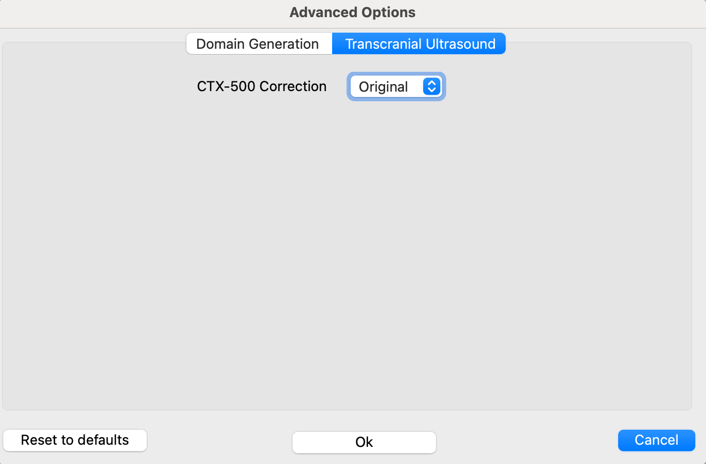

Advanced features
----
Since release 0.3.5, BabelBrain includes a menu for advanced options controlling low-level details in BabelBrain.

If any of these options are modified, they will remain persistent on the next BabelBrain sessions. Select `Reset to defaults` to restore original values.

# Domain Generation

## Elastix co-registration Optimizer
The default optimizer for Elastix, AdaptiveStochasticGradientDescent, works *almost* for every combination of CT->T1W and ZTE/PETRA->T1W. However, as much more testing has started to accumulate, we noticed that the CT->T1W was not working in some cases. We tested different options in Elastix, and the **FiniteDifferenceGradientDescent** and **QuasiNewtonLBFGS** seem to work well as a replacement. If the coregistration from CT to T1W is not working as expected, try one of these two other options. **FiniteDifferenceGradientDescent** seems to work better.

## Proportion of trabecular bone
By default, the percentage of trabecular is 80% using the line of sight of the trajectory. If the trajectory crosses very thin regions like the parietal bone, there may be a chance all region is considered trabecular, which may not be desired. A warning message will be printed out in the terminal output in that case. In such cases as the parietal bone, consider reducing a lower value of trabecular, such as 0.1 or 0.2.

## Force using Blender for Constructive Solid Geometry
While pycork seems to do a great replacement, we identified that in some instances when using the subvolume feature there was a crash in the low pycork library. Forcing using Blender instead can help to run those special cases.

## Manual Subvolume
This feature is intended to give a bit more control for scenarios where the trajectory is regions where the skin mask may cause some issues, especially in targets near the back of the head. For most targets, there is no need to make any adjustments, but we have spotted a few cases (i.e., EEG-P7 location) in which the skin mask of the back of the head was pushing the whole domain and causing issues to place correctly the transducer. For these scenarios, adjusting a subvolume to extract for the simulations can mitigate these issues. This can also help to reduce image size for high-resolution cases.

# Transcranial Ultrasound

## CTX-500 Correction
Starting R0.4.0, BabelBrain introduced a parabollic correction to the Rayleigh's integral-based modeling of the CTX-500 transducer. This small correction ensures that the TPO setting (center of FLHM focal spot at -3dB) matches better how the experimental unit operates. There are two options: **Original** and **July 2024**. The **Original** setting matches how the CTX-500 unit was modelled in previous releases (<= 0.3.5) and **July 2024** has the new correction. Please note that the correction is only a couple mm when focusing at the deepest target.

The newer **CTX 250** and **CTX 500** transducers (introduced in R0.4.0) have already this correction by default.