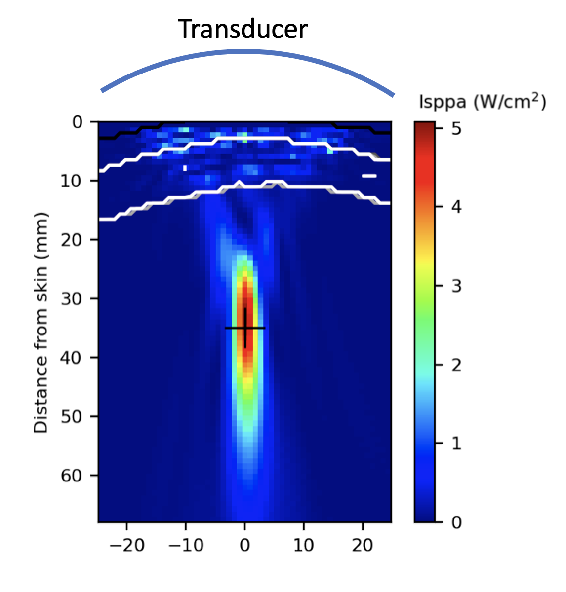

# Appendix - Tissue properties

**BabelBrain v0.2.1**

The complex composition of the skull bone causes significant distortion of the ultrasound transmission into the brain cavity. To this date, there is not yet a definitive method to produce maps of acoustic properties (density, speed of sound and attenuation). For a very comprehensive review of modeling efforts including different approaches to produce maps of acoustic properties, please consult Angla *et al.*[@angla_transcranial_2022]. BabelBrain includes three approaches to creating 3D maps of acoustic properties

## Simplified skull mask based on T1W+T2W imaging
A skull mask based on T1W+T2W imaging (Fig. 1) can be obtained by using output data generated by SimNIBS 3.X `headreco` or SimNIBS 4.X `charm` pre-processing tools. While these tools were designed for transcranial magnetic stimulation purposes, some of the output data of these tools can be repurposed for transcranial ultrasound. BabelBrain calculates a binary mask where 20% following a line-of-sight is classified as cortical bone and 80% as trabecular bone. The regions in contact with skin and brain tissue are defined as cortical bone. The outputs of SimNIBS tools are also used to produce the mask regions for skin and brain tissue. 

 

<em>Fig 1. Example of domain generation for simplified skull mask.</em>

### Common material properties

| Material type | Long. Speed of sound (m/s) | Density (kg/m$^3$)| Long. attenuation (Np/m)$^*$|
|-------|---------|------|-------|
| Water | 1500 | 1000 | 0 |
| Skin | 1500 | 1000 | 4.6 $f^{1.0}$ |
| Brain| 1610 | 1090 | 6.9 $f^{1.0}$  |

$^*f$ = frequency in MHz
Reference: Aubry *et al.*[@aubry_benchmark_2022]
### Simple skull mask 
| Material type | Long. Speed of sound (m/s) | Density (kg/m$^3$)| Long. attenuation (Np/m)*|
|-------|---------|------|-------|
| Cortical| 120$f$ + 2416 $^*$  |     1896.5 |   |
| Trabecular| 282$f$ + 2063 $^*$  |1738.0 | |

Reference: $^*$Pichardo *et al.*[@pichardo_multi-frequency_2010]

## CT based mapping
Because of its relationship with bone density, computed tomography (CT) scans of skull bone have been used as a surrogate to calculate acoustic properties maps suitable for transcranial ultrasound modeling[@angla_transcranial_2022]. While the use of acoustic maps derived from CT scans has been successful to facilitate the development of procedures that became approved for use in clinic[@elias_randomized_2016], it has been in a very specific set of conditions. Webb *et al.* presented two studies detailing clearly how XRays energy level, scanner model and CT kernel reconstruction influence acoustic properties derived from Hounsfield units (HU)[@webb_measurements_2018]$^,$[@webb_acoustic_2021]. BabelBrain uses the mapping of properties proposed by Webb who developed a linear fitting of the speed of sound and attenuation in function of the HU, where CT acquisition conditions are considered.

### Rationale - An study of modern mapping methods
A study was performed to evaluate different mapping procedures from CT scans to acoustic properties. The choice of the mapping between CT scan and acoustic properties was done after performing tests with different mappings methods and five CT scans representing a sampling of skull density ratio (SDR). The SDR is a metric that measures the HUs of trabecular bone over cortical. The SDR is a metric used in the treatment of essential tremor with MRI-guided focused ultrasound (MRIgFUS). The SDR has typical values between 0.3 and 0.8 and has been identified as one of the factors determining the effectiveness to produce thermal rising for surgical purposes[@chang_factors_2016]$^{,}[@boutet_relevance_2019]. The lower the SDR, the less effective the MRIgFUS procedure is to produce thermal rising at the surgical target; in a way, the SDR is an indirect metric associated with the global attenuation of the skull bone. 

#### Methods
Transcranial ultrasound simulations were performed with CT scans obtained for essential tremor patients who were treated for essential tremor and obsessive-compulsive disorder with an MRIgFUS procedure at the University of Calgary. A study was approved by the Ethics Board of the University of Calgary to select five subjects representing a sampling of SDR values. SDR was calculated by the planning software of the MRIgFUS Neuro system (Exablate, Haifa, Israel). The selected SDR values were 0.32, 0.44, 0.55, 0.67 and 0.79. Scans were collected with a Discovery CT750 HD scanner (GE, MW, USA) with an energy level of 120 kVp, BONEPLUS reconstruction kernel, pixel resolution of 0.45 mm, slice thickness of 0.625 and space between slices of 0.66 mm. 

T1- and T2-weighted MRI scans of the participants were also collected with a Discovery 750 3T MRI scan (GE, MW, USA). T1-weighted imaging was acquired using BRAVO, General Electric’s 3D inversion recovery-prepared fast spoiled gradient echo (FSPGR) sequence with the following parameters: TR/TE/TI ​= ​8.2/3.2/650 ​ms, 10° flip angle, 256 ​mm ​× ​256 ​mm x 188 ​mm field of view, 256 ​× ​256 x 188 matrix, sagittal-oblique orientation to approximate alignment with AC-PC, GRAPPA (ARC) factor of 2 in the phase encode direction. T2-weighted imaging was acquired using 3D fast spin-echo (FSE) with the following parameters: TR ​= ​3000 ​ms, TE ​= ​60–90 ​ms, echo train length ​= ​130, 256 ​× ​256 x 188 matrix (zero-filled to 512 ​× ​512 x 376), 256 ​× ​225 ​× ​188 ​mm field of view, sagittal-oblique orientation to approximate alignment with AC-PC, and a GRAPPA (ARC) factor of two in both the phase encode and slice direction. MRI scans were processed with [SimNIBS 4.0's](https://github.com/simnibs/simnibs/releases) `charm` tool[@thielscher_field_2015].The apparent density was calculated with the method developed by Marsac *et al*.[@marsac_ex_2017]. Regions of the skull bone were thresholded between 300 HU and 2100 HU. The following mapping procedures to produce acoustic map properties from CT scans were evaluated:

* Pichardo's method fitted the apparent density from HU to the speed of sound and attenuation at different individual frequencies[@pichardo_multi-frequency_2010]. A linear interpolation was performed between the reported attenuation curves for frequencies between 0.27 and 0.836 MHz. For frequencies between 0.1 and 0.27 MHz, the attenuation was scaled linearly with a factor $\left({\frac{f}{0.27~\text{MHz}}}\right)^1$. For frequencies between 0.836 and 1 MHz, a similar factor $\left({\frac{f}{0.836~\text{MHz}}}\right)^1$ was applied.
* Webb's methods converted directly from HU to speed of sound[@webb_measurements_2018] and attenuation[@webb_acoustic_2021]. Fitting parameters were selected for a GE scanner using an energy of 120 kVp, BONEPLUS kernel reconstruction, axial resolution of 0.5mm and slice resolution of 0.6 mm. 
* McDannold's method was based on analysis of the thermal rise in essential tremor procedures with MRIgFUS and transcranial ultrasound modeling [@mcdannold_elementwise_2019]. McDannold calculated fitted coefficients between apparent density derived from CT scans and speed of sound and attenuation. Attenuation fitting from McDannold was scaled linearly with a factor $\left({\frac{f}{0.66~\text{MHz}}}\right)^1$ where $f$ is the frequency in MHz. 

Transcranial ultrasound modeling was performed with BabelBrain for each of the five datasets representing the different SDR values. The selected target in each subject was a region below M1 motor cortex (approximately 35 mm from the skin). As shown in Fig. 2, a transducer with a diameter of 50 mm and F# of 1.0 was placed 3 mm above the skin region with a trajectory that ensure normal incidence conditions.  

 

<em>Fig 2. Example of ultrasound modeling showing transducer and bone interfaces (white lines). Target is placed 35mm from the skin interface (not shown)</em>

Simulations with BabelBrain were done for frequencies between 0.1 to 1 MHz, with steps of 0.1 MHz, with a spatial resolution of 6 points-per-wavelength (PPW). In viscoelastic wave modeling, attenuation losses can be modeled using a $Q$ factor[@alma991012368939704336], which describes the loss of energy after traveling a $\pi$-distance, as shown by

$$
\begin{align}
Q=\frac{\omega}{2c\alpha(\omega)},
\end{align}
$$

where $\omega$ is angular frequency, $c$ is the speed of sound and $\alpha(\omega)$ the attenuation in Np/m at the frequency $\omega$. In practice, the underlying numerical solver [BabelViscoFDTD](https://github.com/ProteusMRIgHIFU/BabelViscoFDTD) uses an optimization of relaxation constants and memory variables to match a given value of $Q$. Details can be found in Pichardo *et al*. [@pichardoViscoelasticModelPrediction2017b].

A particular challenge when using a given mapping procedure is that attenuation is the result of both absorption and scattering. Because of the skull bone complexity, it is often challenging to separate them correctly, which could explain partially the large discrepancies in previous efforts mapping HU to attenuation[@webb_acoustic_2021]. Pinton *et al*.[@pintonAttenuationScatteringAbsorption2012] demonstrated with viscoelastic and thermal modeling combined with micro CT scans of skull bone that the absorption was a small fraction of the total attenuation; 2.7 dB/cm at 1 MHz of pure absorption losses vs. 16.6 dB/cm of total attenuation (including both scattering and absorption). Because the CT scans in clinic systems can, for the most, acquire at resolutions of 0.5 mm or larger, there is a significant partial volume effect caused by the microstructure of the bone material, especially in the trabecular region. Because of this ambiguity, BabelViscoFDTD allows a correction factor $q_c$ applied to $Q$ such as $Q=Q_0q_c$, where $Q_0$ is the original associated with a given value of $\alpha(\omega)$. For each combination of values of SDR and frequency, transcranial modeling was done for values of  $q_c$  of 0.6, 1.0, 1.5, 2.0, 3.0, 4.0, 5.0, 6.0 and 7.0.

A pressure transmission coefficient $T$ was calculated by comparing simulated ultrasound fields with the presence of the skull and in water-only conditions.  

$$
\begin{align}
T = \sqrt{\frac{\sum_{x,y} I_{\text{SPPA-skull}}(x,y,z_m)}{\sum_{x,y}I_{\text{SPPA-water}}(x,y,z_m)}},
\end{align}
$$

where $I_{\text{SPPA-skull}}(x,y,z_m)$ and $I_{\text{SPPA-water}}(x,y,z_m)$ are the spatial-peak pulse-average acoustic intensity in presence of the skull and water conditions, respectively, over a plane $(x,y)$ at a distance $z_m$ that was chosen at the location of maximal pressure in water conditions. The results of simulated $T$ with the different mapping methods were compared to values of $T$ reported in litterature []
 A root-mean-square error (RMSE) was calculated between simulated $T$ and reported values in literature [@pichardo_multi-frequency_2010]$^{,}$[@attaliThreelayerModelAbsorption2023]. Pichardo[@pichardo_multi-frequency_2010] reported energy transmission coefficient $E$. The pressure transmission coefficient was calculated with $T=\sqrt{E}$. Simulations were executed in an iMac Pro computer system (Apple, Cupertino, CA) equipped with a  3 GHz Xeon-W processor (10 cores) and 128 GB RAM. Acceleration of calculations was done with an external AMD 6800 Pro graphical processor unit with 32 GB RAM.
#### Results
 
\bibliography

