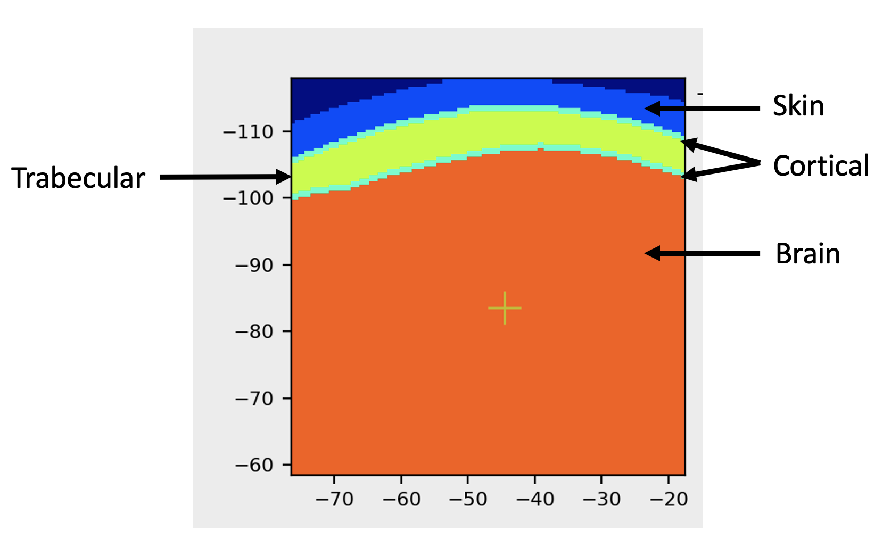

# Appendix - Tissue properties

**BabelBrain v0.2.1**

The complex composition of the skull bone causes significant distortion of the ultrasound transmission into the brain cavity. To this date, there is not yet a definitive method to produce maps of acoustic properties (density, speed of sound and attenuation). For a very comprehensive review of modeling efforts including different approaches to produce maps of acoustic properties, please consult Angla *et al.* (2002) "*Transcranial ultrasound simulations: A review*" [DOI:10.1002/mp.15955](https://doi.org/10.1002/mp.15955). BabelBrain includes three approaches to creating 3D maps of acoustic properties

## Simplified skull mask based on T1W+T2W imaging
A skull mask based on T1W+T2W imaging can be obtained by using output data generated by SimNIBS 3.X `headreco` or SimNIBS 4.X `charm` pre-processing tools. While these tools were designed for transcranial magnetic stimulation purposes, some of the output data of these tools can be repurposed for transcranial ultrasound. BabelBrain calculates a binary mask where 20% following a line-of-sight is classified as cortical bone and 80% as trabecular bone. The regions in contact with skin and brain tissue are defined as cortical bone. The outputs of SimNIBS tools are also used to produce the mask regions for skin and brain tissue. 

 

### Basic material properties

| Material type | Long. Speed of sound (m/s) | Density (kg/m$^3$)| Long. attenuation (Np/m)$^*$|
|-------|---------|------|-------|
| Water | 1500 | 1000 | 0 |
| Skin | 1500 | 1000 | 4.6 $f^{1.0}$ |
| Brain| 1610 | 1090 | 6.9 $f^{1.0}$  |

$^*f$ = frequency in MHz
Reference: Aubry *et al.* [DOI:10.1121/10.0013426](https://doi.org/10.1121/10.0013426)
### Simple skull mask 
| Material type | Long. Speed of sound (m/s) | Density (kg/m$^3$)| Long. attenuation (Np/m)*|
|-------|---------|------|-------|
| Cortical| 120$f$ + 2416 $^*$  |     1896.5 |   |
| Trabecular| 282$f$ + 2063 $^*$  |1738.0 | |

Reference: $^*$Pichardo *et al.* [DOI:10.1088/0031-9155/56/1/014](https://doi.org/10.1088/0031-9155/56/1/014)

## CT based mapping
Because of its relationship with bone density, computed tomography (CT) scans of skull bone have been used as a surrogate to calculate acoustic properties maps suitable for transcranial ultrasound modeling (Angla *et al.*, 2022, [DOI:10.1002/mp.15955](https://doi.org/10.1002/mp.15955)). While the use of acoustic maps derived from CT scans has been successful to facilitate the development of procedures that became approved for use in clinic (Elias *et al.* 2016, [DOI:10.1056/NEJMoa1600159](https://doi.org/10.1056/NEJMoa1600159)), it has been in a very specific set of conditions. Webb *et al.* presented two studies detailing clearly how XRays energy level, scanner model and CT kernel reconstruction influence acoustic properties derived from Hounsfield units (HU) (Webb *et al.*, 2018, [DOI:10.1109/TUFFC.2018.2827899](https://doi.org/10.1109/TUFFC.2018.2827899); Webb *et al.*, 2020, [DOI:10.1109/TUFFC.2020.3039743](https://doi.org/10.1109/TUFFC.2020.3039743)).

BabelBrain uses a mapping of properties proposed by 

The choice of the mapping between CT scan and acoustic properties was done after performing tests with different mappings methods and five CT scans representing a sampling of skull density ratio (SDR). The SDR is a metric that measures the HUs of trabecular bone over cortical. The SDR is an important metric used in the treatment of essential tremor with MRI-guided focused ultrasound (MRIgFUS)as the SDR has been identified as one of the factors determining the effectiveness to produce thermal rising for surgical purposes (Seok Chang *et al*, 2015, [DOI:10.3171/2015.3.JNS142592](https://doi.org/10.3171/2015.3.JNS142592); Boutet *et al.*, 2019, [DOI:10.3171/2019.2.JNS182571](https://doi.org/10.3171/2019.2.JNS182571)), in a way the SDR is an indirect metric associated to the global attenuation of the skull bone. Tests were performed with CT scans obtained for participants scheduled for an MRIgFUS thalamotomy for essential tremor at the University of Calgary. A study was approved by the Ethics Board of the University of Calgary to select five subjects representing a sampling of SDR values. SDR was calculated by the planning software of the MRIgFUS Neuro system (Exablate, Haifa, Israel). The selected SDR values were 0.32, 0.44, 0.55, 0.67 and 0.79. Scans were collected with a Discovery CT750 HD scanner (GE, MW, USA) with an energy level of 120 kVp, BONEPLUS reconstruction kernel, pixel resolution of 0.45 mm, slice thickness of 0.625 and space between slices of 0.66 mm. 

T1- and T2-weighted MRI scans were also collected with a Discovery 750 3T MRI scan (GE, MW, USA). T1-weighted imaging was acquired using BRAVO, General Electric’s 3D inversion recovery-prepared fast spoiled gradient echo (FSPGR) sequence with the following parameters: TR/TE/TI ​= ​8.2/3.2/650 ​ms, 10° flip angle, 256 ​mm ​× ​256 ​mm x 188 ​mm field of view, 256 ​× ​256 x 188 matrix, sagittal-oblique orientation to approximate alignment with AC-PC, GRAPPA (ARC) factor of 2 in the phase encode direction. T2-weighted imaging was acquired using 3D fast spin-echo (FSE) with the following parameters: TR ​= ​3000 ​ms, TE ​= ​60–90 ​ms, echo train length ​= ​130, 256 ​× ​256 x 188 matrix (zerofilled to 512 ​× ​512 x 376), 256 ​× ​225 ​× ​188 ​mm field of view, sagittal-oblique orientation to approximate alignment with AC-PC, and a GRAPPA (ARC) factor of two in both the phase encode and slice direction. MRI scans were processed with [SimNIBS 4.0's](https://github.com/simnibs/simnibs/releases) `charm` tool ( Thielscher *et al.*, 2015, [DOI:10.1109/EMBC.2015.7318340](https://doi.org/10.1109/EMBC.2015.7318340)).

The mapping procedures to produce acoustic map properties that were tested included the following methods:
    
* Webb's methods to convert directly from HU to speed of sound (2018, [DOI:10.1109/TUFFC.2018.2827899](https://doi.org/10.1109/TUFFC.2018.2827899)) and attenuation (2020, [DOI:10.1109/TUFFC.2020.3039743](https://doi.org/10.1109/TUFFC.2020.3039743)). Fitting parameters were selected for a GE scanner using an energy of 120 kVp, BONEPLUS kernel reconstruction, axial resolution of 0.5mm and slice resolution of 0.6 mm.
* McDannold method (2019) based on analysis of the thermal rise in essential tremor procedures with MRgFUS and transcranial ultrasound modeling ([DOI:10.1103/PhysRevResearch.1.033205](https://doi.org/10.1103/PhysRevResearch.1.033205)). McDannold calculated fitted coefficients between apparent density derived from CT scans and speed of sound and attenuation. Attenuation fitting from McDannold was scaled linearly with a factor $\left({\frac{f}{0.65 MHz}}\right)^1$ where $f$ is the frequency in MHz.

