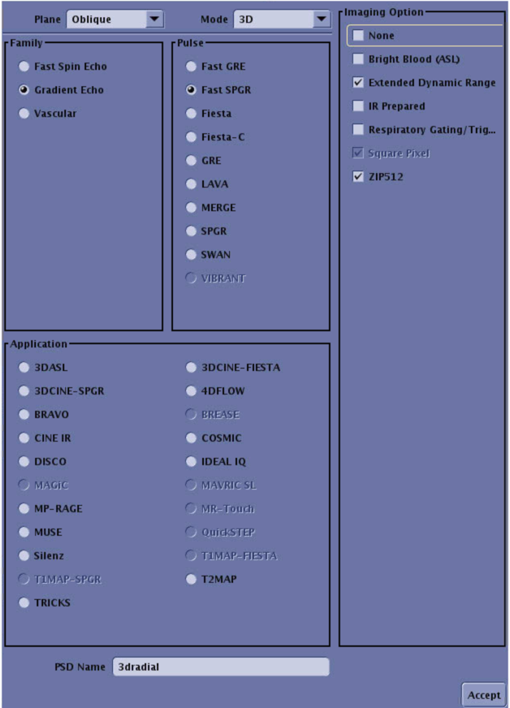
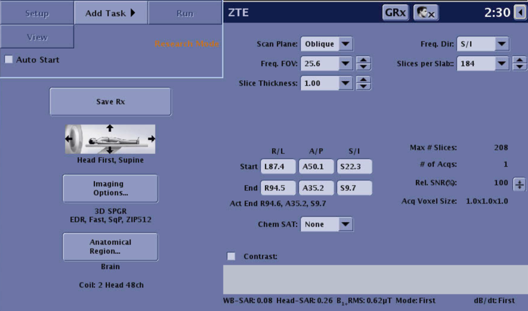
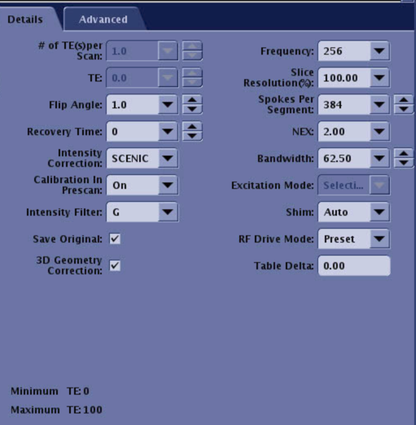
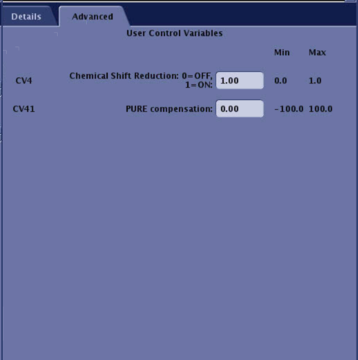

MRI Sequences
-----
# Basics
The T1W sequence **must be 1-mm isotropic**. Otherwise, some parts of the processing may fail. Overall,  it is highly recommended that all MRI sequences used in the planning with BabelBrain to be 1-mm isotropic,

# ZTE for GE Scanners
The recommended ZTE sequence is derived from a **3dradial** GE PSD, with saggital orientation, reconstruction matrix of 256x256, receiver bandwidth of 62.5 kHz (pixel bandwith of 244 Hz), NEX=3.5, with chemical shift correction enabled, and using SCENIC intensity correction (PURE is also acceptable). The exported settings are available in  <a href="GE_Protocol.pdf" target="_blank">BabelGE_Protocol.pdf</a>
 and in the protocol  [GE_protocol.tar](GE_protocol.tar) file. While the protocol file is the most rigorous approach to reproduce the sequence, please note the protocol file is not backwards compatible with GE DV versions of the console. Be sure of reaching your local GE Clinical Scientist to assist if using the protocol file. 

**VERY IMPORTANT**: The number of slabs and slice resolution are not exported in the parameters. Please use **Slices per slab = 184**, and match the same for the T1W and T2W scans. Use **Slice Resolution = 100%**, to keep the acquisition 1mm isotropic

Below there are screnshots of the console showing how the sequence should appear

# PETRA for Siemens Scanners
We recommend using the <a href="https://github.com/ucl-bug/petra-to-ct/blob/main/scanfiles/PETRA.exar1" target="_blank">EXAR1</a> file available at the
<a href="https://github.com/ucl-bug/petra-to-ct" target="_blank">UCL's PETRA-TO-CT Github repository</a>. A  [local](PETRA.exar1) copy is also provided for convenience.
