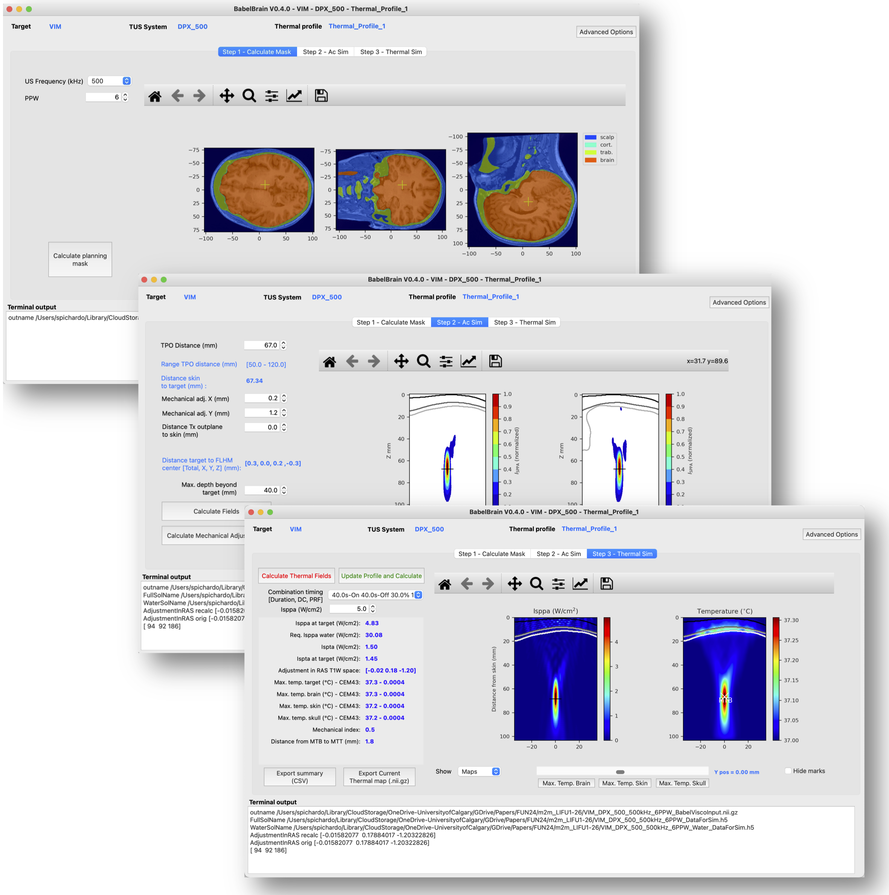
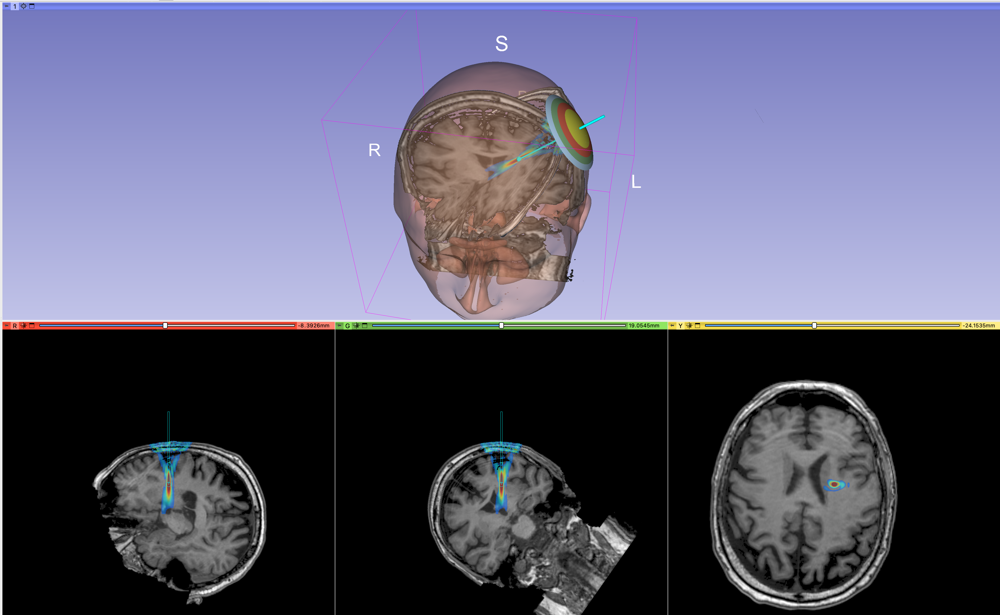

BabelBrain 
=============
**v0.2.9-b**  
October 14th, 2023.

Samuel Pichardo, Ph.D  
Associate Professor  
Radiology and Clinical Neurosciences, Hotchkiss Brain Institute  
Cumming School of Medicine,  
University of Calgary   
samuel.pichardo@ucalgary.ca  
[www.neurofus.ca](https://www.neurofus.ca)

**GUI application for the modeling of transcranial ultrasound for neuromodulation applications**

BabelBrain is a frontend application for research purposes only in the study of applications of transcranial focused ultrasound. BabelBrain calculates the transmitted acoustic field in the brain tissue, considering the distortion effects caused by the skull barrier. BabelBrain also calculates the thermal effects of a given ultrasound regime, which is regulated mainly by the total duration of ultrasound exposure, the duty cycle of ultrasound use, and the peak acoustic intensity,

BabelBrain is designed to work in tandem with neuronavigation and/or visualization software (such as Rogue Research's Brainsight or 3DSlicer). This tool combines image processing to prepare domains for ultrasound simulation and uses  [BabelViscoFDTD](https://github.com/ProteusMRIgHIFU/BabelViscoFDTD) extensively for transcranial modeling calculations. BabelViscoFDTD is a finite-difference time-difference solver of isotropic viscoelastic equation, which was implemented to support multiple GPU backends (Metal, OpenCL and CUDA).  Predictions of BabelViscoFDTD have been validated experimentally ([Pichardo *et al.*, 2017](https://pubmed.ncbi.nlm.nih.gov/28783716/)) and cross-validated with other numerical tools for ultrasound propagation ([Aubry *et al.*, 2022](https://asa.scitation.org/doi/10.1121/10.0013426)). BabelBrain supports multiple GPU backends (Metal, OpenCL and CUDA) and works in all major operating systems, with an emphasis on Apple ARM64-based systems, which are very common in brain imaging research.  

# Citation
If you find BabelBrain useful for your research, please consider adding a citation to:  
Pichardo S. BabelBrain: An Open-Source Application for Prospective Modeling of Transcranial Focused Ultrasound for Neuromodulation Applications.  
IEEE Trans Ultrason Ferroelectr Freq Control. 2023 Jul;70(7):587-599.  
doi: [10.1109/TUFFC.2023.3274046](https://doi.org/10.1109/TUFFC.2023.3274046). Epub 2023 Jun 29. PMID: 37155375.

# Disclaimer
This software is provided "as is" and it is intended exclusively for research purposes.

## Licensing
BSD 3-Clause License

Copyright (c) 2022,2023 Samuel Pichardo
All rights reserved.

Redistribution and use in source and binary forms, with or without
modification, are permitted provided that the following conditions are met:

1. Redistributions of source code must retain the above copyright notice, this
   list of conditions and the following disclaimer.

2. Redistributions in binary form must reproduce the above copyright notice,
   this list of conditions and the following disclaimer in the documentation
   and/or other materials provided with the distribution.

3. Neither the name of the copyright holder nor the names of its
   contributors may be used to endorse or promote products derived from
   this software without specific prior written permission.

THIS SOFTWARE IS PROVIDED BY THE COPYRIGHT HOLDERS AND CONTRIBUTORS "AS IS"
AND ANY EXPRESS OR IMPLIED WARRANTIES, INCLUDING, BUT NOT LIMITED TO, THE
IMPLIED WARRANTIES OF MERCHANTABILITY AND FITNESS FOR A PARTICULAR PURPOSE ARE
DISCLAIMED. IN NO EVENT SHALL THE COPYRIGHT HOLDER OR CONTRIBUTORS BE LIABLE
FOR ANY DIRECT, INDIRECT, INCIDENTAL, SPECIAL, EXEMPLARY, OR CONSEQUENTIAL
DAMAGES (INCLUDING, BUT NOT LIMITED TO, PROCUREMENT OF SUBSTITUTE GOODS OR
SERVICES; LOSS OF USE, DATA, OR PROFITS; OR BUSINESS INTERRUPTION) HOWEVER
CAUSED AND ON ANY THEORY OF LIABILITY, WHETHER IN CONTRACT, STRICT LIABILITY,
OR TORT (INCLUDING NEGLIGENCE OR OTHERWISE) ARISING IN ANY WAY OUT OF THE USE
OF THIS SOFTWARE, EVEN IF ADVISED OF THE POSSIBILITY OF SUCH DAMAGE.

