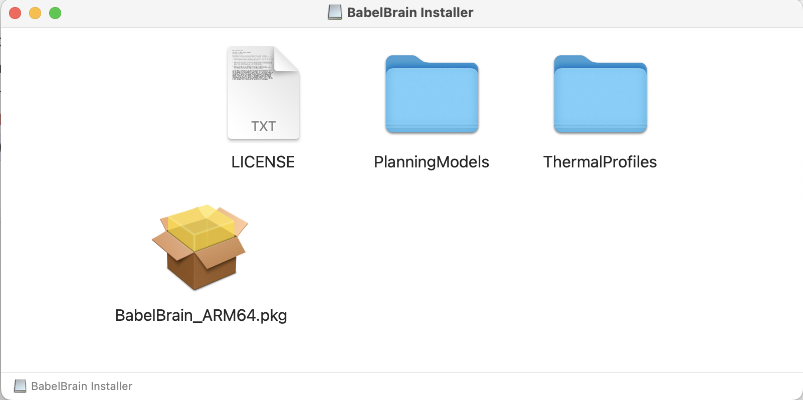

Installation and Running
----
# Preliminary requirements 
## OS
Currently, macOS (ARM64, X64), Windows/Linux (X64) are supported. Windows users can run BabelBrain natively or via [WSL2](https://learn.microsoft.com/en-us/windows/wsl/install) with NVidia GPUs (see this [guide](https://docs.nvidia.com/cuda/wsl-user-guide/index.html)). 

### GPU
BabelBrain supports GPUs enabled via CUDA, OpenCL or Metal. High-end GPUs (8 GPU RAM or more) are recommended. ARM64 processors (M1, M2, M3 families) in Mac systems with 16GB or more RAM are highly recommended. BabelBrain was designed with Mac systems based on Mx processors as primary targets. 
#### Note for Intel-based Mac systems
Intel-based systems need to have a dedicated AMD GPU (internal or external via Thunderbolt). Intel-based iMac Pro and MacPro systems have internal GPUs suitable for sub 500 kHz simulations (i.e., Vega 56, Vega 64). An external GPU (i.e., AMD W6800 Pro) offers excellent performance and capability for high-frequency simulations.

**Important note**. Before v0.3.4, BabelBrain required having installed Blender for some CSG operations. This is not required anymore for v0.3.4 and up.

### SimNIBS
While BabelBrain does not invoke directly SimNIBS tools, BabelBrain depends on the output generated by SimNIBS 3.x `headreco` or SimNIBS 4.x `charm` processing tools. Consult the [Releases](https://github.com/simnibs/simnibs/releases) section in SimNIBS for installation options. We recommended using SimNIBS 4.x `charm` for better results.

### Optional -FSL
[FSL](https://fsl.fmrib.ox.ac.uk/fsl/fslwiki)'s flirt tool is used as a backup method if dealing with imaging datasets that are not 100% orthogonal; ITK often can't handle them and flirt can be used to enforce orthogonal affine matrices. This situation happens rarely, but it comes with the limitation that FSL is only available in macOS and Linux.  FSL's init scripts must be activated in the .bash_profile or .zsh_profile.

### Navigation-planning software
While not strictly required, it is highly recommended to use planning software to establish the target localization and orientation, called **trajectory** in the following documentation, of the ultrasound transducer for the simulation of transcranial ultrasound. The trajectory is just a transformation matrix in the T1W space that represents the translation-rotation of a vector describing the target and direction of ultrasound. BabelBrain can import trajectories defined in proprietary software ([Rogue Research's](https://www.rogue-research.com/) Brainsight) or open-source visualization software ([3DSlicer](https://www.slicer.org/)). Instructions are detailed in the pipeline section of this documentation. 

Starting with BabelBrain v0.3.2 and Brainsight v2.5.3, BabelBrain can be directly called from Brainsight, importing simulations automatically once the BabelBrain execution is completed.

# Standalone application
Ready-to-use applications (no need for Python installation) for macOS and Windows are available in the [Releases](https://github.com/ProteusMRIgHIFU/BabelBrain/releases) section. Please note that for macOS there are installers for ARM64 (M1 and newer Apple Silicon processors) and Intel X64, so be sure to pick the correct version matching your hardware. 

For MacOS, open the DMG file and double-click on the package installer. 

The first time you will use you may be prompted to authorize it to run and access directories. You may also need to authorize it in the Security settings of macOS.

For Windows, download the MSI installer file and run to install BabelBrain. Shortcuts will be created in the Desktop and Start menu. **Note**: CUDA 11.7+ must be installed.

Keep a copy of the `PlanningModels` and `Profiles` directories. `PlanningModels` contain STL files useful for the planning of TUS. `Profiles` contains examples of timings of the TUS exposure (total duration on, duration off, duty cycle).

# Manual Installation 
Python 3.9/3.10. Anaconda/miniconda is recommended. - if running in Apple ARM64 processors (M1, M1 Max, etc.), be sure to use a native ARM64 version.

Clone the [BabelBrain](https://github.com/ProteusMRIgHIFU/BabelBrain/) repository. The code can be run in a Python environment; consult examples of conda environment files in the repository. In macOS, you need a healthy XCode installation with command line tools installed. For Linux, an LTS Ubuntu installation such as 20.04 with a  CUDA installation. For Windows, Visual Studio 2019+ with CUDA 11.7+.

# Running
## Standalone application
Just open BabelBrain from the Applications section in macOS or in Windows from the Start Menu.

## Manual execution
Activate the conda environment, change to the `BabelBrain/BabelBrain` directory and execute

`python BabelBrain.py`

# Building standalone application

A pyinstaller specification file is provided to build the macOS and Windows applications. In the `BabelBrain/BabelBrain` directory run

`pyinstaller BabelBrain.spec --noconfirm` 

A new application will be created at `BabelBrain/BabelBrain/dist/`
