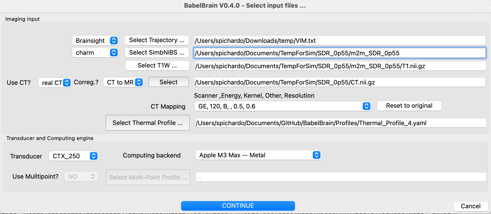

#  BabelBrain Simulation
Now that planning is done, you can open BabelBrain.


1. **If using a version of Brainsight previous to 2.5.3**: Open BabelBrain either from the Applications menu in macOS if the DMG installer was used, from the Start menu if in Windows or with `python BabelBrain.py` if using the manual installation.

2. **If using Brainsight version 2.5.3 and up**: In the lower-left corner of Brainsight's target UI, there is a simulation panel. Specify first an output directory to save the results, then click on the "FUS" button and the BabelBrain GUI will open.


## Input data
An input dialog will prompt the different input files required for the simulation. If running directly from BrainSight, some of these fields (marked below with an "*") will be pre-populated.



1. Specify the path to the trajectory file and the source (Slicer or Brainsight) (*).
2. Select the SimNIBS output directory associated with this test and indicate what tool was used to generate it (`headreco` or `charm`) (*)
3. Select the path to the T1W Nifti file (*)
4. Indicate if CT scan is available. Options are "No", "real CT" or "ZTE". Select if coregistration of CT to T1W space must be performed. Depending on your specific preliminary steps, you may have CT already coregistered in T1W space. If coregistration is done by BabelBrain, the resolution of the CT will be preserved. The T1W file will be first bias-corrected and upscaled to the CT resolution and then the CT will be coregistered using the `itk-elastix` package with rigid coregistration.
5. Select the CT mapping profile that matches the better the CT scanner. Consult papers by Webb *et al.* about  
<a href="https://doi.org/10.1109/TUFFC.2018.2827899" target="_blank">speed of sound</a>
and 
<a href="https://doi.org/10.1109/TUFFC.2020.3039743" target="_blank">attenuation</a>
 as a function of CT scanning conditions. For most practical scenarios, if using GE, the most common scanner combination will **GE, 120, B,, 0.5, 0.6**. For Siemens scanners, it will be **Siemens,120,B,,0.4, 0.5**.

    When selecting **ZTE** or **PETRA** scans, the best CT combination will be selected automatically.
    
5. Select a thermal profile file for simulation. This is a simple YAML file where the timings of transcranial ultrasound are specified. For example:

    ```
    BaseIsppa: 5.0 # W/cm2
    AllDC_PRF_Duration: #All combinations of timing that will be considered
    -   DC: 0.3
        PRF: 10.0
        Duration: 40.0
        DurationOff: 40.0
    ```

    
    This definition helps in the step of thermal simulation with BabelBrain. `BaseIsspa` is the reference value of acoustic intensity for which the thermal equation will be solved. You can set this to 5 W/cm$^2$. Choices for other powers will be scaled (no recalculations) based on this value.


    For scenarios where repeated exposures is required, the extra field `Repetitions` can be added. For example:

    ```
    BaseIsppa: 5.0 # W/cm2
    AllDC_PRF_Duration: #All combinations of timing that will be considered
    -   DC: 0.3
        PRF: 10.0
        Duration: 30.0
        DurationOff: 30.0
        Repetitions: 10
    ```

    In the previous case, the simulation will run for an exposure lasting 10 min, where ultrasound is turned on for 30s, followed by 30s with ultrasound off, and repeated 10 times.

    More than one exposure can be specified. For example:
    
     ```
     BaseIsppa: 5.0 # W/cm2
     AllDC_PRF_Duration: #All combinations of timing that will be considered
         -   DC: 0.3
             PRF: 10.0
             Duration: 40.0
             DurationOff: 40.0
         -   DC: 0.1
             PRF: 5.0
             Duration: 80.0
             DurationOff: 50.0
     ```

    When running the thermal simulation step, all the combinations specified in the thermal profile will be calculated.
     

7. Select the type of transducer to be used in simulations.

6. Optional. Select a multi-point profile file for simulations. BabelBrain offers the possibility to execute electronic steering over a list of points if a concave array is selected. If any of the three concave arrays is selected (H317, I12378 and ATAC), the user can select a profile definition specific to multi-point steering. This is a simple YAML file where the timings of transcranial ultrasound are specified. For example:
   
     ```
     MultiPoint:
     -   X: 2.0
         Y: 0.0
         Z: 0.0
     -   X: -1.0
         Y: 1.73205081
         Z: 0.0
     -   X: -1.0
         Y: -1.73205081
         Z: 0.0
     ```

    In this example, we create a 3-point steering list that makes a 3-point star with a radius from the origin of 2 mm.

7. Once all inputs are set, then click on "CONTINUE"
   
## STEP 1 - Domain generation
The diagram below shows flowchart describing the process for the domain generation.


The first step after specifying input data is to create the simulation domain. The available operating frequencies will depend on the selected transducer. The second main input is the resolution of the simulation expressed in the number of points per wavelength (PPW). The minimum for fast estimation is 6 PPW, and 9 PPW to meet criteria de convergence when compared to other <a href="https://asa.scitation.org/doi/10.1121/10.0013426/" target="_blank">numerical tools</a>.

 Depending on if CT or ZTE scans are available, options to fine-tune the domain generation will be available. For CT scans, the user can adjust the threshold for bone detection (set by default to 300 HU). For ZTE scans the user can specify the thresholds to select normalized ZTE signal (by default 0.1 and 0.6) to convert to pseudo-CT. Please consult <a href="https://ieeexplore.ieee.org/document/9856605/" target="_blank">Miscouridou et al.</a>  for details on the "classical" approach to convert from ZTE to pseudo-CT.
 
 The execution time in M1 Max processor can take from 1 minute of minutes up to 10 minutes depending on the resolution and availability of ZTE/CT scans.
 When initiating the calculations, a detailed log output will appear in the bottom region of the window. In case of any error during processing, a dialog message will prompt indicating to consult this window for more details. Once executed, orthogonal views of the domain will be shown. T1W scan is also shown to verify that the mask was correctly calculated. 


Once executed, a Nifti file containing the mask describing the different tissue regions will be produced in the directory where the T1W Nifit file is located. It will have a file with the following structure:
`<Name of target file>_<Frequency>_<PPW>_BabelViscoInput.nii.gz`, for example `LinearTransform_500kHz_6PPW_BabelViscoInput.nii.gz`. The mask will be in T1W space, facilitating its inspection as overlay with T1W data. The mask has values of 1 for skin, 2 for cortical bone, 3 for trabecular and 4 for brain tissue. A single voxel with a value of 5 indicates the location of the target. The raw data inside the Nifti file is organized in a 3D Cartesian volume that is aligned to the transducer acoustic axis. The Nifti affine matrix ensures the mask can be inspected in T1W space.

If a CT or ZTE dataset is indicated as input, the skull mask will be created using this scan rather than the output of `headreco` or `charm`. Also, an overlay of the CT/pseudo-CT will be also shown for verification purposes. 

 

If the co-registration is not correct enough, you can adjust the Elastix co-registration option in the [advanced menu](../Advanced/advanced.md#elastix-co-registration-optimizer).


Please note if a `<Name of target file>_<Frequency>_<PPW>_BabelViscoInput.nii.gz` file exists, the GUI will ask confirmation to recalculate the mask. Selecting "No" will load the previous mask. 

STL files are produced from the file `final_tissues.nii.gz` created by charm. Meshes are created and smoothed (Laplace filtering), and the mask for simulation is calculated via GPU-accelerated voxelization. The STL files of skin, csf and bone will be saved in the output directory of SimNIBS by BabelBrain. 


##  STEP 2 - Transcranial ultrasound simulation
The second tab in the GUI of BabelBrain shows the ultrasound simulation step.  The diagram below shows a flowchart of this step.


The choices of this tab will depend on the selected transducer. Simulation results in this step are shown in normalized conditions. The final step (see below) later will show the results denormalized in function of the selected intensity at the target. 

### Common features to all transducers
After running a simulation in Step 2, the results window will show two orthogonal views of normalized acoustic intensity. The intensity in the skin and skull regions is masked out (it can be visualized later in those regions in step 3). In this step, the main goal is to ensure a correct spatial focusing on the target. Depending on the capabilities of the transducer, this will imply for the most doing a combination of **mechanical corrections** and (if available) use of **steering** capabilities. The common features to all transducers are highlighted by the red box in the figure below


### Distance of the maximal depth
This distance is set a default value of 40 mm and controls how deep the simulation domain extends beyond the focal point. For many targets and transducers, 40 mm is more than enough. But for devices producing large focal spots, it may be necessary to extend this value. This is particular important if the far field region gets too close to bony structures as this can help to model potential reflections.

### Mechanical corrections
All transducers show an action to perform mechanical corrections that mimic moving the transducer in the X, Y, and Z directions to make sure the focal spot is well centred at the target. Corrections on X and Y mimic moving the transducer along the scalp. Use these corrections to compensate refraction effects that may push laterally a focal spot. 
Corrections on Z, which appear in the GUI for most transducers as **Distance Tx outplane to skin** mimic placing some distance between the scalp and the transducer; for example, when using a gel pad.

After running a first pass of simulations in Step 2, a button action **Calculate Mechanical Adjustments** is available to calculate the distance from the target to the center of mass of the focal spot at -3dB and suggest applying the required mechanical corrections in X and Y directions. This action should help to minimize the number of iterations in simulations looking to ensure the focal spot is aligned in the X and Y directions to the intended target.

The GUI shows a label with the "Distance target to FLHM center [X, Y, Z] (mm)" that helps to perform adjustments with mechanical and steering corrections.

Please note that in the simulation domain, X, Y and Z are not mapped to subject coordinates directly in the GUI. However, at the end of the simulations in Step 3, there will be a report in which direction in the T1W space this adjustment translates. Also, as noted below, the modified trajectory will be saved automatically.

###  Modified trajectory - VERY IMPORTANT
Every time a simulation in Step 2 is run, Babelbrain saves automatically the corrected trajectory in the same directory where the input trajectory is located. A **_mod** suffix will be added to the file; for example, if the input file was `R_Vim.txt`, the modified trajectory will be called `R_Vim-mod.txt`.

This trajectory is the one that is recommended to be used in neuronavigation when performing the **real** experiment. This trajectory will help to place the transducer in the position that helps to compensate for the skull refraction effects.

When running in tandem with Brainsight, this trajectory will be loaded automatically along with the results as shown below


### Transducers
#### CTX_250, CTX_500 and DPX_500


For the CTX_250, CTX_500 and DPX_500 transducers, the initial assumption is that this type of transducer will be placed in direct contact with the skin and that the focusing distance will be adjusted according to the desired target. 

The initial "TPO Distance" (an adjustable parameter in the TPO NeuroFUS device) is calculated based on the distance skin to the target. 

It is recommended to simulate with the default values to evaluate the degree of focus shift caused by the skull. Adjust both mechanical corrections as described above and combined with the TPO Distance to ensure your target is correctly engaged.

#### H246
The H246 transducer has a similar operation as the CTX_500. The steps presented above apply similarly. As the H246 transducer has a much longer focal length, consider extending the maximal depth of simulations.


#### H317, I12378 and ATAC
These transducers assume that a coupling cone is in contact with the skin. The user interface shows small differences compared to CTX_500 and H246. There is a parameter for the `Distance cone to Focus` that depends on the acoustic cone used for coupling. Because these transducers are phased arrays, the user interface shows also the option to perform electronic refocusing and multifocus.
 


####  Single
The "Single" transducer is a generic device with a configurable diameter and focal length. Because this is a more general-purpose device, it is not assumed that the transducer is in direct contact with the skin. The transducer is always initially centered at the target, which means that there could be some space between the transducer out plane and the skin. The user can adjust the mechanical distance on the Z axis until the point of the out plane of the transducer reaches the skin.
 


####  BSonix
These are commercial transducers with fixed focal lengths as reported in <a href="https://doi.org/10.1109/TUFFC.2020.3006781" target="_blank">Schafer et al.</a>. The user can select focal length of 35, 55, 65 and 80 mm. Similar to the CTX_500, it is assumed the device is in direct contact with the skin, with the option to move the transducer away from the skin to simulate placing a coupling pad. 
 


####  REMOPD
This transducer is a flat device that shows features that combine functionalities similar to the H246 and phased arrays.


## STEP 3 - Thermal simulation
The third tab in the GUI of BabelBrain shows the thermal simulation step.  The diagram below shows a flowchart of this step.


The thermal simulation solves the Bio-heat thermal equation (BHTE) for all the combinations of duty cycle, timing and ultrasound exposure indicated in the thermal profile definition file. 
 


The selection of spatial-peak pulse-average intensity ($I_{\text{SPPA}}$) indicates the desired intensity at the target. The spatial-peak time-average intensity ($I_{\text{SPTA}}$) is calculated based on the selected timing conditions.  Based on the selections of timing and desired $I_{\text{SPPA}}$ in tissue, the $I_{\text{SPPA}}$ in water conditions is calculated after taking into account all the losses. Thermal safety parameters (maximal temperature and thermal doses) in the skin, skull bone and brain tissue are calculated at the locations showing the highest temperature elevation in the whole 3D volume. The `MTB`, `MTS` and `MTC` push buttons in the lower region of the interface select the slice corresponding to the maximal temperature in brain, skin and skull, respectively.

The `Update Profile and Calculate` action can be used to load an updated version of the thermal profile file. This will force the recalculation of thermal results.

The `Show` dropdown menu can be used to select the 2D intensity and thermal `Maps` or `Profiles` that shows the temporal evolution of temperature at the target and locations of maximal temperature at skin, skull and brain tissue.


The `Export summary (CSV)` action exports the input data paths and user selections used for the simulations. It also includes a table of $I_{\text{SPPA}}$ in water conditions and safety metrics in function of the desired $I_{\text{SPPA}}$ in tissue. Below there is an example of the exported data.

| Isppa | IsppaWater | MI   | Ispta | MTB  | MTS  | MTC  | CEMBrain    | CEMSkin     | CEMSkull    |
|-------|------------|------|-------|------|------|------|-------------|-------------|-------------|
| 0.5   | 2.38       | 0.18 | 0.15  | 0.03 | 0.01 | 0.02 | 0.00033419  | 0.000329626 | 0.00033046  |
| 1     | 4.77       | 0.25 | 0.3   | 0.07 | 0.03 | 0.04 | 0.000343142 | 0.000333787 | 0.000335482 |
| 1.5   | 7.15       | 0.31 | 0.45  | 0.10 | 0.04 | 0.05 | 0.000352388 | 0.000338007 | 0.000340589 |
| 2     | 9.54       | 0.35 | 0.6   | 0.13 | 0.06 | 0.07 | 0.00036194  | 0.000342286 | 0.000345782 |
| 2.5   | 11.92      | 0.39 | 0.75  | 0.17 | 0.07 | 0.09 | 0.000371807 | 0.000346625 | 0.000351062 |
| 3     | 14.31      | 0.43 | 0.9   | 0.20 | 0.09 | 0.11 | 0.000382002 | 0.000351024 | 0.000356431 |
| ...    | ...     | ...  | ...    | ...  | ...  | ...  |...  | ...  | ...  |

The `Export maps (.nii.gz)` action exports the thermal, pressure and intensity fields in Nifti format based on the selected Isppa at target. This can be used for inspection in neuronavigation and visualization software