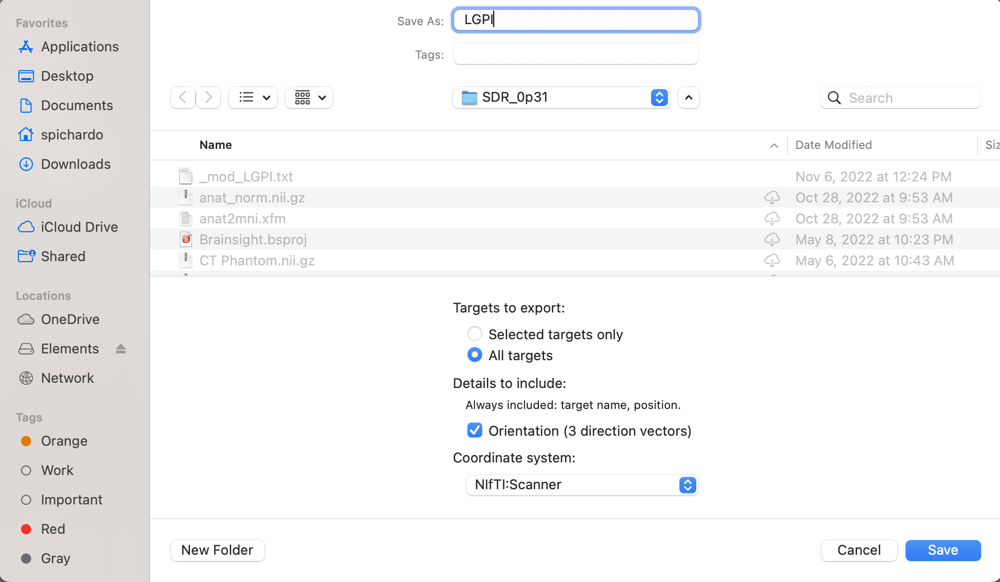

# Planning

The goal of the planning step is to produce a **trajectory** that provides the location where ultrasound is intended to be focused and the orientation of the transducer in T1W coordinate space. In practice, the trajectory is just an affine matrix applied to a "virtual" needle that describes the **location** and **orientation** where focused ultrasound is desired to be concentrated. The tip of the trajectory needs to be at the intended target. The position of the transducer will be relative to the tip location. The details using 3DSlicer can illustrate this.

## Acoustic path STL helpers
BabelBrain includes a series of complementary STL files representing the "acoustic" path. Each STL file includes a group of circular meshes combined with a target needle that represent the acoustic cross sections of a field produced with a transducer with F#=1.0 at different depths. As noted in the instructions below, these meshes help to verify a correct alignment with the skin.

## Planning with 3DSlicer
1. Install the **SlicerIGT** extension in 3DSlicer (restart 3DSlicer if requested)
2. Load T1W planning data

    

3. In the IGT extension menu, select "Create Models"

    

4. Load one of the STL helpers as a `model` with `RAS` coordinate convention. The model will appear by default centred in the T1W space and pointing in the inferior$\rightarrow$superior direction

    

    Alternatively, you can create a needle with a length of 100 mm. 
    
    

    

5. Select the model in the data panel and edit the properties to make it appear in the "Slice Display"

    

6. Create a new transform and give it a name related to the target (e.g. LGPI, RSTN, LVIM, RM1, etc.). This is important as BabelBrain will use the name of the transform as a prefix for its output files.

    

    Apply the transform to the  model and be sure the transformation is set to `local` (little button next to the "invert" button)

    

7. Select "Volume Reslice Driver" in the IGT module menu

    

8. Select the linear transform in the two first slice views

    

9. Select one view to be "Inplane" and the other to be "Inplane 90"

    

10. In the Data panel, select the linear transform and edit properties, you should be able to see the slice views aligned along the model 

    

11. Adjust the location of the tip of the needle using the **translation** (LR, PA, IS) controls to match the tip of the model to your area of interest.

    

12. Adjust the trajectory path using the **rotation** (LR, PA, IS) controls until finding a trajectory that has a clear path and mimics how the transducer will be placed. Tip: Adjust the trajectory to make it orthogonal to the skin surface in the inline and inline90 views; this recreates the condition of placing a transducer aligned relative to the skin.

    

    Note: If you navigate to other windows in 3DSlicer, the transition and rotation control may be set back to 0s. But the transformation matrix will remain with the latest values applied. Any other adjustment will be added to the transformation matrix. Be sure that the `local` option is always selected.

13. Save the transformation in text format. Select "Save data" and select text as the file format. Take note of the path. Suggestion: Select a directory in the same path where T1W or SimNIBS output is located. 

## Planning with Brainsight
Alternatively, planning can also be performed with the proprietary software Brainsight made by Rogue Research (Montreal, Canada) for the planning and execution of non-invasive neuromodulation. This software has an existing feature that exports a trajectory that can be used in BabelBrain. The workflow to export a trajectory is very similar to 3DSlicer.

**Important**: Starting with BabelBrain v0.3.2 and Brainsight v2.5.3, BabelBrain can be directly called from Brainsight, importing simulations automatically once the BabelBrain execution is completed.

1. If using Brainsight v2.5.3, create a new "SimNIBS" project; If using an older version of Brainsight, create an "empty" project.

2. If using  "SimNIBS" project, it will preload the T1W imaging dataset automatically. Otherwise, load T1W planning data manually.  

    

3. Open target window

    

4. Adjust coordinates and orientation with control in the user interface (right side of screen)

    

5. Create a new target as a trajectory

    

6. Rename the trajectory with a name related to the target (e.g. LGPI, RSTN, LVIM, RM1, etc.)

4. **If using a version of Brainsight previous to 2.5.3**:  Export trajectory with "Export" function and select "Orientation (3 directions vectors)" and "NifTI:Scanner" as the coordinate system. Take note of the path. Suggestion: Select a directory in the same path where T1W or SimNIBS output is located. This step is not required if using Brainsight version 2.5.3 and up.

    