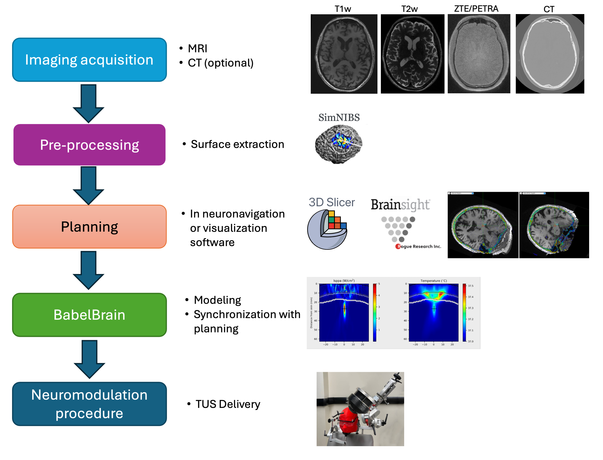

# Pipeline description
BabelBrain takes 3D imaging data (MRI and, if available, CT) along with a trajectory indicating the location and orientation of an ultrasound transducer to target a location in the brain.

Currently, ten types of transducers are supported:

* **Single**. This is a simple focusing single-element transducer. The user can specify diameter, focal length and a frequency between 100 kHz and 1 MHz.
* **H317**. This is a 128-element phased array with a focal length of 135 mm and F#=0.9. The device is capable to operate at 250, 700 and 825 kHz.
* **CTX_250**. This is a device commercialized by the company BrainBox that has 4 ring elements, with a focal length of 63.2 mm and F# = 0.98, and operates at 250 kHz. The system can steer the focal spot location (measured by the center of half-peak intensity or -3dB) from 25 to 60 mm from the outplane of the device.
* **CTX_500**. This is a device commercialized by the company BrainBox that has 4 ring elements, with a focal length of 63.2 mm and F# = 0.98, and operates at 500 kHz. The system can steer the focal spot location (measured by the center of half-peak intensity or -3dB) from 33 to 80 mm from the outplane of the device.
* **DPX_500**. This is a device commercialized by the company BrainBox that has 4 ring elements, with a focal length of 144.9 mm and F# = 2.26, and operates at 500 kHz. The system can steer the focal spot location (measured by the center of half-peak intensity or -3dB) from 50 to 120 mm from the outplane of the device.
* **H246**. This is a flat ring-type device that has 2 annular elements, with a diameter of 33.6 mm and operates at 500 kHz. It offers some degree of focusing by using two transducer elements.
* **BSonix**. These are devices commercialized by the company Brainsonix at fixed focal lengths of 35, 55, 65 and 80 mm as reported in
<a href="https://doi.org/10.1109/TUFFC.2020.3006781" target="_blank">Schafer et al.</a>.
* **I12378**. This is a 128-element device operating at 650 kHz with a focal length of 72 mm and F#=0.7.
* **ATAC**. This is a 128-element device operating at 1 MHz with a focal length 53.2 mm and F#=0.9.
* **REMOPD**. This is a 256-element flat 2D array commercialized by the company Fraunhofer IBMT capable to operate at 300 and 490 kHz with a diameter of 58 mm.
* **R15148**. This is a 128 elements focused device with focal length of 80 mm, diameter of 103 mm, and operates at 500 kHz.

The specific capabilities of each transducer are considered during the simulations. 

## Overall workflow
The typical TUS workflow working with BabelBrain is shown below

The next sections cover these steps

