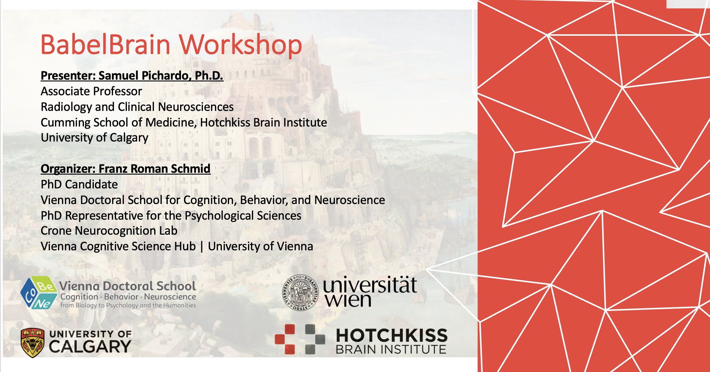

Presentations
----

**This area will contain material and links to relevant presentation material**

# University of Vienna Workshop - 2026-04-07

This is a 2hr presentation on important aspects to consider when using BabelBrain in your research. Material (video recording, slides and syllabus) hosted at OSF:

[https://osf.io/wxnje](https://osf.io/wxnje)

 If deciding to follow the exercises in the syllabus, consider using [prerelease version of BabelBrain 0.8.1](https://github.com/ProteusMRIgHIFU/BabelBrain/releases/tag/0.8.1-prelease)

 Special thanks, and huge shoutout, for the organizer of the workshop, **Franz Schmid**, Ph.D. Candidate at the Crone Neurocognition Lab, Vienna Doctoral School for Cognition, Behavior, and Neuroscience, in the Faculty of Psychology of the University of Vienna. 
 
