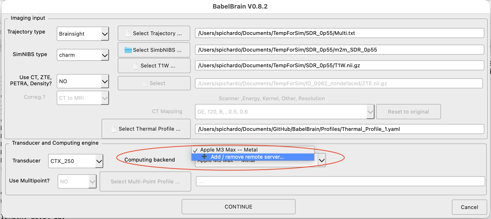
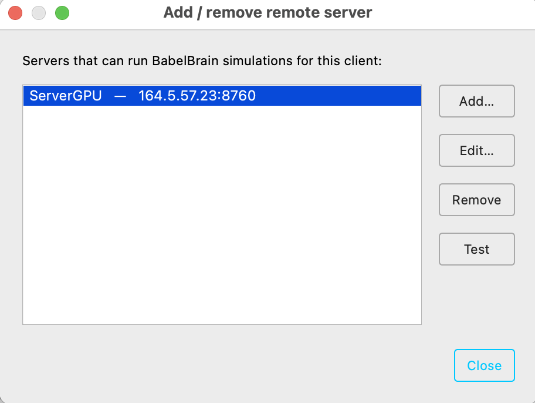
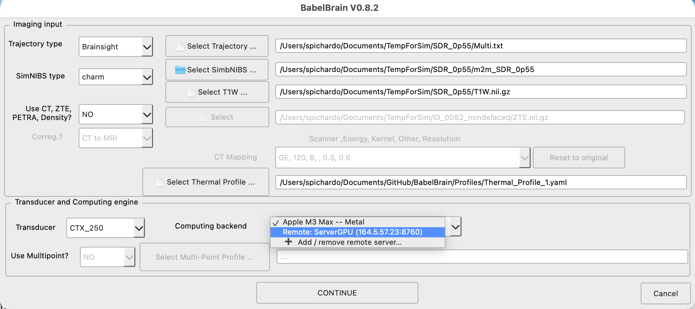

# Server mode

BabelBrain can run as a **job server**: it exposes the pipeline over a small
HTTP/JSON API so language-agnostic clients (Python, C#, C++, `curl`, …) can
submit jobs, follow progress, and collect results over the network. It is the
same engine used by [scripting](Coding/scripting.md), with a network front-end and a
job queue.


**Important notes:**

* **Multiple workers** — one BabelBrain process drives per GPU available in the server, so
  jobs are processed simultaneously as many GPU are available.
* **Stateless server operation mode** - while persistant mode (data permanently stored in server) is feasible, the recommended operation is to use the server as stateless, where the client sends the data needed for calculations and recovers the artifacts.
* **Declarative jobs** — a job specifies inputs, which steps to run, and
  parameter overrides (no arbitrary remote code).
* **Local first** — binds to `localhost` by default. For any access beyond the
  local machine, configure a token and encrypt the traffic: see
  [Transport security (TLS)](#transport-security-tls).

## Starting the server

```bash
python BabelBrain/BabelBrain.py --serve --headless               # localhost:8760, no GUI shown
python BabelBrain/BabelBrain.py --serve --serve-host 164.5.34.1  # specify IP address of exposed network interface to accept requests
python BabelBrain/BabelBrain.py --serve --serve-host 164.5.34.1 --serve-port 9000 --serve-token SECRET # specify also different port number and secret TOKEN 
```

Token use is **HIGHLY RECOMMENDED**, and often required by IT, when using in a large network
### Running from the binary distribution
The frozen application works the same way (`BabelBrain.exe --serve …` /
`BabelBrain.app/Contents/MacOS/BabelBrain --serve …`). Stop the server with
`Ctrl-C`.

### Server mode options

| Option | Effect |
| --- | --- |
| `--serve` | Run as a job server. |
| `--serve-host` | Bind address (default `127.0.0.1`). |
| `--serve-port` | Port (default `8760`). |
| `--serve-token` | Require `Authorization: Bearer <token>` on every endpoint (or set `BABEL_SERVER_TOKEN`). |
| `--serve-certfile` | PEM **certificate** to serve over HTTPS instead of plain HTTP (or `BABEL_SERVER_CERTFILE`). See [Transport security](#transport-security-tls). |
| `--serve-keyfile` | PEM **private key** that pairs with `--serve-certfile` (or `BABEL_SERVER_KEYFILE`). |
| `--serve-cafile` | CA bundle used to **require and verify client certificates** (mutual TLS; or `BABEL_SERVER_CAFILE`). Advanced — most setups leave this off. |
| `--headless` | Run with no window (for a remote/headless GPU box). |

> **Safety guard.** When the server binds a **non-loopback** address (anything other
> than `127.0.0.1`/`localhost`) it will **refuse to start without a token**, and will
> **warn** if TLS is not enabled (the token would otherwise cross the network in
> cleartext). Set the environment variable `BABEL_SERVER_ALLOW_INSECURE=1` to override
> the guard — for example when a reverse proxy terminates TLS in front of BabelBrain.

# Client configuration
In BabelBrain client operation (normal GUI mode), the uer can use a remote server in the same way as it would be a local GPU. No data will be preserved in the server. Be aware that during the execution of a session, files will be transferred back and forth between the client and server. Files will be deleted once the client closes its session or the server is stopped.

The user can configure a remote server in the list of "Computing Backends":



this will show a small dialog where the user can add a new server where IP address, port and optional secret token can be specified



Be aware that multiple server entries can be created.

Once defined, the configured servers will be available as a list of computing backend:




# Server API

| Method & path | Purpose |
| --- | --- |
| `GET /healthz` | Liveness + `{busy, queued}`. The only endpoint that never needs auth. |
| `GET /capabilities` | Server info, incl. the list of available `transducers`. |
| `GET /defaultconfig` | BabelBrain's **default** advanced configuration (clean baseline). |
| `GET /currentconfig` | The server's **current** advanced configuration (which may be needed to recover some paths for tools like SimNIBS). |
| `POST /jobs` | Submit a [JobSpec](#jobspec) (the `config` field is **mandatory**); returns `{job_id}` (`202`). |
| `GET /jobs` | List all jobs (summaries). |
| `GET /jobs/{id}` | Job status: `state`, `phase`, `percent`, `error`, `artifacts`, `exit_code`. |
| `GET /jobs/{id}/events?since=N` | Progress events from index `N` (polling). |
| `GET /jobs/{id}/stream` | Same events as **Server-Sent Events** (push). |
| `POST /jobs/{id}/cancel` | Cancel a queued job, or request cancellation of the running one (honored between steps). |

### Configuration is client-owned and mandatory

The [advanced configuration](Coding/advanced_config.md) is **owned by the client**, not
stored per-session on the server. Every job **must** carry its own `config`
object; a submission without it is rejected (`400`).

The usual flow is: fetch a baseline, tweak, and send the whole dictionary back:

* `GET /defaultconfig` — BabelBrain's pristine defaults (what the immense
  majority of clients want: a clean, deterministic starting point).
* `GET /currentconfig` — the server's current values (e.g. a sanitized site
  baseline an operator configured). Read-only.

In **server mode the configuration is memory-only**: the server never writes
`lastselection.yaml`, and a job's config affects only that job. (Persisting is
allowed only for a normal, local non-server session.)

### JobSpec

A `JobSpec` (POST body, JSON) has three parts: input-selection fields, the
mandatory `config`, and `steps`.

```json
{
  "t1w": "/data/sub-01/T1W.nii.gz",
  "simbnibs": "/data/sub-01/m2m_sub-01/",
  "trajectory": "/data/sub-01/target.txt",
  "thermal_profile": "/data/profile.yaml",
  "transducer": "CTX_500",
  "ct_type": "CT",
  "ct": "/data/sub-01/CT.nii.gz",
  "output_path": "/data/sub-01/output/",
  "recalculate": true,

  "config": { "...": "the full advanced-config object from /defaultconfig" },

  "steps": {
    "planning": [
      {"action": "set", "control": "USMaskkHzDropDown", "value": "500"},
      {"action": "set", "control": "USPPWSpinBox", "value": 6},
      {"action": "set", "control": "HUThresholdSpinBox", "value": 300},
      {"action": "run"}
    ],
    "acoustic": [
      {"action": "select_trajectory", "index": 0},
      {"action": "set", "control": "ZSteeringSpinBox", "value": 3.0},
      {"action": "set", "control": "XSteeringSpinBox", "value": 0.0},
      {"action": "run"},
      {"action": "select_trajectory", "index": 1},
      {"action": "run"},
      {"action": "click", "control": "CombineTrajectories"}
    ],
    "thermal": [
      {"action": "select_trajectory", "index": 0},
      {"action": "run"},
      {"action": "click", "control": "ExportSummary", "wait": false},
      {"action": "click", "control": "ExportMaps", "wait": false}
    ]
  }
}
```

* **Input fields** (`t1w`, `simbnibs`, `transducer`, `ct_type`, …) are the
  [`launch()` inputs](Coding/scripting.md#launch-selecting-inputs) — the SelFiles-level
  selections. Step-1 controls (frequency, PPW, HU threshold) are **not** here;
  they are `planning` actions, so the client controls them and their order.
* `config` — **mandatory** advanced configuration (see above).
* `recalculate` — `true` recomputes; `false` reloads cached results.
* `use_last_selection` — seed omitted input fields from the last GUI session.
* `steps` — an object with any of `planning` / `acoustic` / `thermal`, each an
  **ordered list of actions**. Steps run in pipeline order; actions run exactly
  in the order given.

### Actions

Each action targets the controls of its step (`planning` → the main window,
`acoustic`/`thermal` → the current trajectory tab). Control names are the same
as in [Scriptable operations](Coding/operations.md).

| Action | Fields | Effect |
| --- | --- | --- |
| `set` | `control`, `value` | Set a control (spin box / check box / drop-down / `USPPWSpinBox`). |
| `select_trajectory` | `index` | Select a trajectory tab (`acoustic`/`thermal` only). |
| `run` | *(optional)* `timeout_ms` | Click the step's run button and wait for completion. |
| `click` | `control`, *(optional)* `wait` (default `true`), `timeout_ms` | Click any button (e.g. `CombineTrajectories`, `CalculateMechAdj`, `ExportSummary`); use `"wait": false` for exports. |

This gives full, ordered control — e.g. *select trajectory 0 → set Z-steering →
run → select trajectory 1 → run → combine* — mirroring what you'd do in the GUI
or in a [script](Coding/operations.md).

### Job lifecycle

`QUEUED → RUNNING → SUCCEEDED | FAILED | CANCELLED`. On `SUCCEEDED`, `artifacts`
lists the produced files (`.h5`, `.nii.gz`, `.csv`) under `output_path`; on
`FAILED`, `error` carries the traceback and `exit_code` is non-zero.

## Client examples

`curl` (remember `config` is mandatory — fetch a baseline first):

```bash
curl -s localhost:8760/capabilities
curl -s localhost:8760/defaultconfig > config.json      # baseline to embed in the job
# ...build a JobSpec (with "config": <config.json>) as spec.json, then:
JOB=$(curl -s -XPOST localhost:8760/jobs --data @spec.json | python -c "import sys,json;print(json.load(sys.stdin)['job_id'])")
curl -s localhost:8760/jobs/$JOB            # poll status
curl -sN localhost:8760/jobs/$JOB/stream    # follow progress (SSE)
```

A complete, dependency-free **Python reference client** ships with the source at

* `BabelBrain/client_server_remote.py` - This mimics how the GUI client BabelBrain operates, where local temporary directories at the server are used to store files during the session life, the client sends input files to the server, then artifacts (results files) are recovered from the server.
* `BabelBrain/client_server_session.py` - This shows how to keep the session alive between Steps 1 to 3, which can be needed when some temporary state persistance is needed. The complete GUI client combines this session mode and the remote temporary file storage shown in `client_server_remote.py`.
* `BabelBrain/client_server_persistent.py` - This shows the case where file paths refer to local locations in the server, showing how to run simulations in the case results are desired to remain in the filesystem of the server.


# Transport security (TLS)

The server drives a GPU and reads/writes files, so treat it as an attack surface
from the outset. Plain HTTP is fine only for `localhost`. As soon as another
machine talks to it, the traffic — including the bearer token — should be
encrypted. There are **two supported shapes**, and picking the right one first
saves a lot of certificate pain:

| Situation | Recommended approach |
| --- | --- |
| A **trusted box on the same network** (Linux / Windows / macOS) that clients reach directly by IP or hostname. | **Self-signed TLS certificate** — *Recipe A* below. |
| A **remote / more serious server** on another network, behind a firewall, not meant to be exposed. | **SSH tunnelling** — no certificate at all. See [Reaching a remote server over SSH](#reaching-a-remote-server-over-ssh). |

> If you can use SSH to reach the box, prefer the tunnel: it is simpler, needs no
> certificate, and is *more* secure because BabelBrain's port is never exposed to
> the network at all.

## Recipe A — a self-signed certificate for a trusted box on the same network

This is the intended setup for a GPU workstation sitting on your lab/clinic LAN
that a handful of trusted clients connect to directly. You generate the
certificate once on the server and copy it to each client so they can trust it.

TLS on the server always needs **two files** — they are a matched pair and you
need **both**:

* a **private key** (`babelbrain-key.pem`) — secret, stays on the server;
* a **certificate** (`babelbrain-cert.pem`) — public, copied to every client.

### The one thing that must be right: the server's address (the "SAN")

A certificate is bound to the **address(es) by which clients reach the server**.
This list lives in a certificate field called the **SAN** (*Subject Alternative
Name* — nothing to do with storage networks). When a client connects to, say,
`https://10.0.0.5:8760`, it checks that `10.0.0.5` is listed in the certificate's
SAN. If it is not, the connection is refused with a *hostname/IP mismatch* error,
**even if the certificate is otherwise perfectly valid**.

> **This is the server's own address — the address a client types to reach it —
> not the address of the clients.** List every hostname and/or IP a client might
> use for this server (e.g. both a DNS name and a raw IP, or several interface
> IPs if the box is multi-homed). The clients' own addresses never appear in the
> certificate.

### Generate the key + certificate

Run this **on the server**, replacing the hostname/IP with how *this server* is
reached on your network. `openssl` ships with the BabelBrain conda environment,
so run it from an activated environment (works identically on Linux, macOS and
the Windows *Anaconda Prompt*):

```bash
openssl req -x509 -newkey rsa:2048 -nodes -days 825 \
  -keyout babelbrain-key.pem -out babelbrain-cert.pem \
  -subj "/CN=gpu-box" \
  -addext "subjectAltName=DNS:gpu-box.mylab.local,IP:10.0.0.5"
```

* `subjectAltName=...` — **the critical part.** Put **every** address clients use
  for this server here. Use `DNS:` for hostnames and `IP:` for raw IP addresses,
  comma-separated. Examples:
    * clients connect by IP only → `subjectAltName=IP:10.0.0.5`
    * clients connect by name only → `subjectAltName=DNS:gpu-box.mylab.local`
    * some use each, or the box has two NICs → `subjectAltName=DNS:gpu-box.mylab.local,IP:10.0.0.5,IP:192.168.1.5`
* `-nodes` — do **not** password-protect the key, so the server can start
  unattended.
* `-days 825` — validity in days (~2 years; many clients reject self-signed
  certificates valid for longer). Regenerate when it expires.
* Keep the key private: on Linux/macOS run `chmod 600 babelbrain-key.pem`.

### Start the server with TLS

```bash
python BabelBrain/BabelBrain.py --serve --headless \
  --serve-host 10.0.0.5 --serve-token SECRET \
  --serve-certfile babelbrain-cert.pem --serve-keyfile babelbrain-key.pem
```

The startup banner will now read `https://…` and `TLS`. (Because the bind is
non-loopback, a token is required — see the safety guard above.)

### Configure the client to trust it

Copy **only** `babelbrain-cert.pem` (never the key) to each client machine. In
BabelBrain's remote-server dialog:

* **Host / IP** — must be one of the addresses listed in the SAN (e.g. `10.0.0.5`
  *or* `gpu-box.mylab.local`; whichever you type must be in the certificate).
* **Port**, **Token** — as configured on the server.
* Tick **Use HTTPS (TLS)** and set **CA file** to the copied `babelbrain-cert.pem`.


For the Python reference clients, point them at the copied certificate:

```python
import client_functions as cf
cf.BASE = "https://10.0.0.5:8760"     # must match a SAN entry
cf.TOKEN = "SECRET"
cf.CA    = "babelbrain-cert.pem"      # trust our self-signed cert
```

> **Last resort only:** ticking *Skip certificate verification* on the client (or
> `cf.INSECURE = True`) disables all verification. It removes the protection TLS
> is meant to provide and invites a man-in-the-middle — use it only for a throwaway
> local test, never in routine operation.

## Reaching a remote server over SSH

For a server on a **separate/remote network** that is not (and should not be)
exposed, do **not** generate a certificate. Leave BabelBrain on its default
loopback bind and reach it through an SSH tunnel — SSH already provides the
encryption, server authentication and user authentication that TLS would, so
adding TLS inside the tunnel is redundant.

**On the server** — bind to loopback (the default), no certificate, nothing
exposed:

```bash
python BabelBrain/BabelBrain.py --serve --headless      # listens on 127.0.0.1:8760 only
```

**On the client** — forward a local port to the server's loopback over SSH:

```bash
ssh -N -L 8760:127.0.0.1:8760 user@remote-gpu-box
```

Now configure a remote server in BabelBrain with **Host `127.0.0.1`**, **Port
`8760`**, **HTTPS off**. The client talks to `http://127.0.0.1:8760` locally and
SSH carries it, encrypted, to the server. There is no certificate to manage and
no SAN to get wrong (a tunnelled cert would have to be issued for `localhost`,
which is more awkward, not less). Add `--serve-token` if you want jobs gated
beyond "has an SSH account" — it travels safely inside the tunnel.

## Reverse proxy (public-facing servers)

For a genuinely public server with a DNS name, the lowest-maintenance option is a
TLS-terminating reverse proxy (e.g. **Caddy**, which obtains and renews a
real Let's Encrypt certificate automatically) with BabelBrain bound to
`127.0.0.1`. Clients then need no certificate configuration at all. Set
`BABEL_SERVER_ALLOW_INSECURE=1` so the loopback-bound BabelBrain does not warn
about serving plain HTTP behind the proxy. This is outside the scope of the
recipes above but is the recommended shape if you must expose the service to the
open internet.
