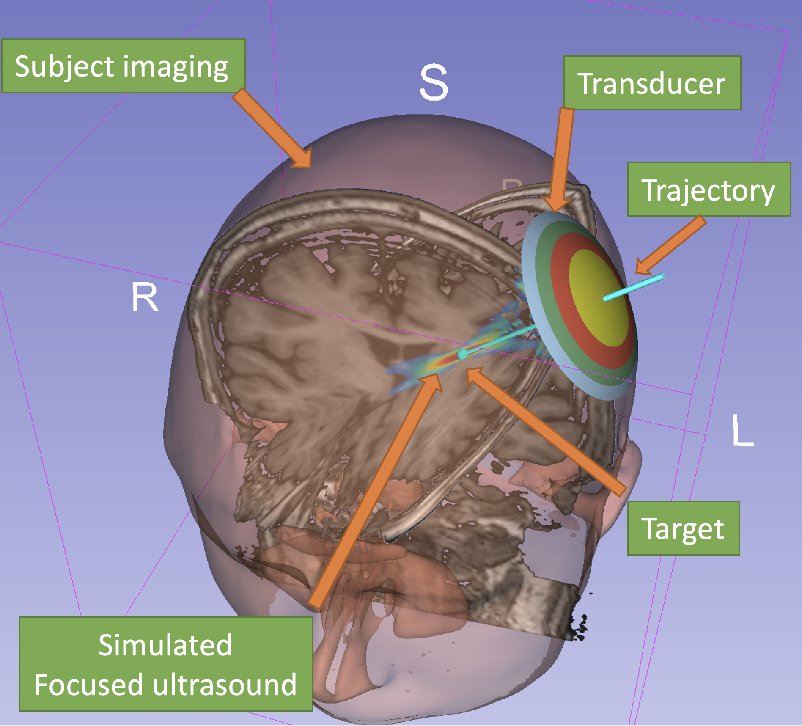

# Pipeline description
BabelBrain takes 3D imaging data (MRI and, if available, CT) along with a trajectory indicating the location and orientation of an ultrasound transducer to target a location in the brain.

