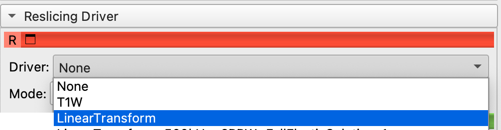
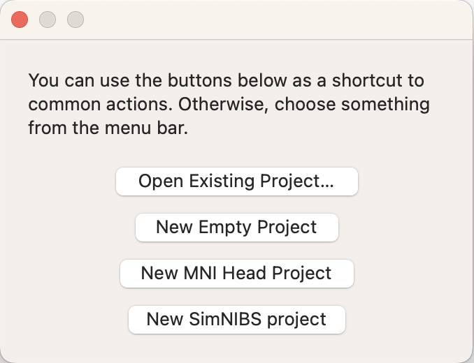
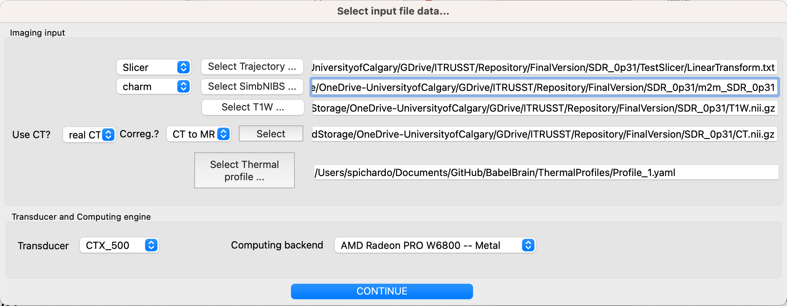

# Pipeline description
BabelBrain takes 3D imaging data (MRI and, if available, CT) along with a trajectory indicating the location and orientation of an ultrasound transducer to target a location in the brain.


## Preliminary steps
* **Mandatory**: Collect T1W and T2W imaging of a participant. Highly recommended to use 3D isotropic (1mm resolution) scans.
* **Mandatory**: Execute  SimbNIBS 3.x `headreco` or SimbNIBS 4.x `charm` processing tool:
    ```
    headreco all <ID> <Path to T1W Nifti file> <Path to T2W Nifti file>
    ```
    or
    ```
    charm <ID> <Path to T1W Nifti file> <Path to T2W Nifti file>
    ```

    `<ID>` is a string for identification. A subdirectory `m2m_<ID>` will be created. Take note of this directory, this will be referred as the **SimNIBS output** directory in the following of this manual. 
* **Mandatory**: Identify the coordinates where you want to focus ultrasound in T1W space. There are many tools (FSL, SPM12, etc) that can be used to convert from standarized space (e.g. MNI) to T1W space.
* *Optional*: CT scan of the participant. Depending on the study being conducted, counting with a CT scan improves the precision of the simulation. 
* *Optional*:: ZTE scan of the participant. A pseudo CT scan can be reconstructed using a Zero Echo Time MRI scan. Details on MRI scan parameters and methods for pseudo-CT reconstruction (using the "classical" approach) can be found in the work presented by [Miscouridou *et al.*](https://ieeexplore.ieee.org/document/9856605) (DOI: 10.1109/TUFFC.2022.3198522). The user needs only to provide the Nifi file of the ZTE scan. BabelBrain will do the transformation to pseudo CT as detailed in Miscouridou *et al.*. A Nifti file with the pseudo CT will be generated.

### Important disclaimer on using exclusively T1W and T2W imaging vs. using CT/ZTE scans
If no CT or ZTE scans are available, a mask representing the skull bone will be generated from the `headreco` or `charm` tools output. Be sure of inspecting the generated mask Nifti (see output files section) file to ensure the mask is correctly calculated. Our experience indicates that `charm` tool produces a better skull mask extraction. When using only T1W and T2W as inputs, BabelBrain uses a generic mask to represent the skull bone (including regions of trabecular and cortical bone). Average values of speed of sound and attenuation are assigned to these bone layers. Consult the appendix section for details on the values used.

If a CT or ZTE scan is provided, a mapping of density, speed of sound and attenuation will be produced. Consult the appendix section for details on the mapping procedure.

# Workflow
Once imaging data is ready, the simulation for transcranial ultrasound is done in 2 main steps: Planning and simulation
## Planning
The goal of the planning step is to produce a **trajectory** that provides the location where ultrasound is intended to be focused and the orientation of the transducer in T1W coordinate space. In practice, the trajectory is just an affine matrix transformation applied to a "virtual" needle that describes the location and orientation where focused ultrasound is desired to be concentrated. The details using 3DSlicer can illustrate this.

### Planning with 3DSlicer
1. Install the **SlicerIGT** extension in 3DSlicer (restart 3DSlicer if requested)
1. Load T1W planning data

2. In the IGT extension menu, select "Create Models"

2. Create a needle with a length of 100 mm. 

Needle will appear by default centred in the T1W space and pointing in the inferior$\rightarrow$superior direction

1. Select the needle in the data panel and edit the properties to make it appear in the "Slice Display"

1. Create a new transform and give it a name related to the target (e.g. LGPI, RSTN, LVIM, RM1, etc.). This is important as BabelBrain will use the name of the transform as a prefix for its output files.

Apply the transform to the needle model and be sure the transformation is set to "local" (little button next to the "invert" button)

2. Select "Volume Reslice Driver" in the IGT module menu

2. Select the linear transform in the two first slice views

3. Select one view to be "Inplane" and the other to be "Inplane 90"

3. In the Data panel, select the linear transform and edit properties, you should be able to see the slice views aligned to the needle 

3. Adjust the location of the tip of the needle using the **translation** (LR, PA, IS) controls to match the tip of the needle to your area of interest.

3. Adjust the rotation of the needle (it will rotate around the tip) using the **rotation** (LR, PA, IS) controls until finding a trajectory that has a clear path and mimics how the transducer will be placed. Hint: Adjust the trajectory to make it orthogonal to the skin surface in the inline and inline90 views; this recreates the condition of placing a transducer aligned relative to the skin.

Note: If you navigate to other windows in 3DSlicer, the transition and rotation control may set back to 0s. But the transformation matrix will remain with the latest values applied. Any other adjustment will be added to the transformation matrix. 
4. Save transformation in text format. Select "Save data" and select text format for the transform. Take note of the path. Suggestion: Select a directory in the same path where T1W or SimbNIBS output is located. 

### Planning with Brainsight
Brainsight is a proprietary software by Rogue Research (Montreal, Canada) for the planning and execution of non-invasive neuromodulation. This software has an existing feature that exports a trajectory that can be used in BabelBrain. The workflow to export a trajectory is very similar to 3DSlicer.
1. Create a new "empty" or "SimNIBS" project; use SimNIBS only if you used SimNIBS 3.x with `headreco`.

1. Load T1W planning data.  If using  "SimNIBS" project, it will preload the T1W imaging dataset.

2. Open target window

3. Adjust coordinates and orientation with control in the user interface (right side of screen)

3. Create a new target as a trajectory

3. Rename the trajectory with a name related to the target (e.g. LGPI, RSTN, LVIM, RM1, etc.)
4. Export trajectory with "Export" function and select "Orientation (3 directions vectors)" and "NifTI:Scanner" as the coordinate system. Take note of the path. Suggestion: Select a directory in the same path where T1W or SimbNIBS output is located. 


## Simulation with BabelBrain
Now that planning is done, open BabelBrain either from the Applications menu in macOS if the DMG installer was used or with `python BabelBrain.py` as indicated in the installation section.

1. An input dialog will prompt the different input files required for the simulation.

    1. Specify the path to the trajectory file and the source (Slicer or Brainsight)
    2. Select the SimNIBS output directory associated to this test and indicate what tool was used to generate it (`headreco` or `charm`)
    3. Select the path to the T1W Nifti file
    4. Indicate if CT scan is available. Options are "No", "real CT" or "ZTE". Select if coregistration of CT to T1W space must be performed. Depending on your specific preliminary steps, you may have CT already coregistered in T1W space. If coregistration is done by BabelBrain, the resolution of the CT will be preserved. The T1W file will be first bias-corrected and upscaled to the CT resolution and then the CT will be coregistered using the `itk-elastix` package with rigid coregistration.
    5. Select a thermal profile file for simulation. This is a simple YAML file where timings of transcranial ultrasound are specified. For example:
        ```YAML
        BaseIsppa: 5.0 # W/cm2
        AllDC_PRF_Duration: #All combinations of timing that will be considered
            -   DC: 0.3
                PRF: 10.0
                Duration: 40.0
        ```
        This definition helps in the step of thermal simulation with BabelBrain.
    6. Once all inputs are set, then click on "CONTINUE"
2. The first step is to create the simulation domain. Depending  