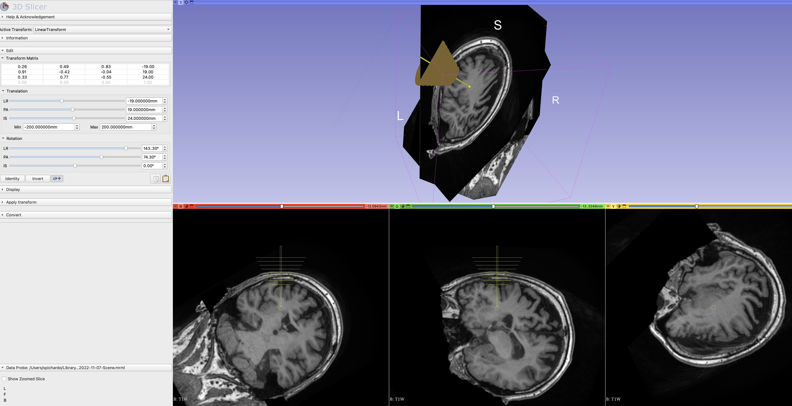
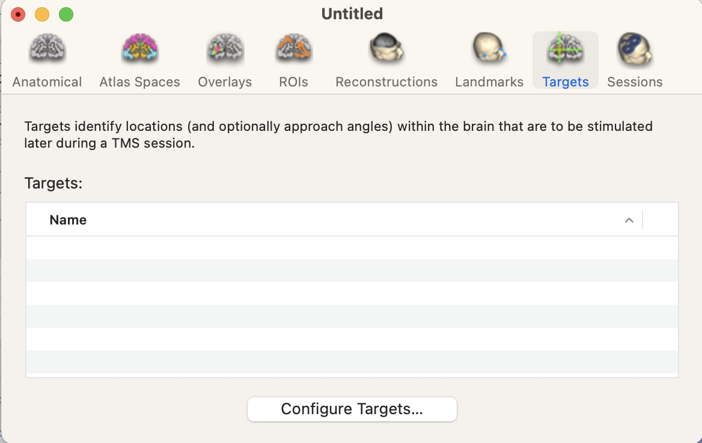
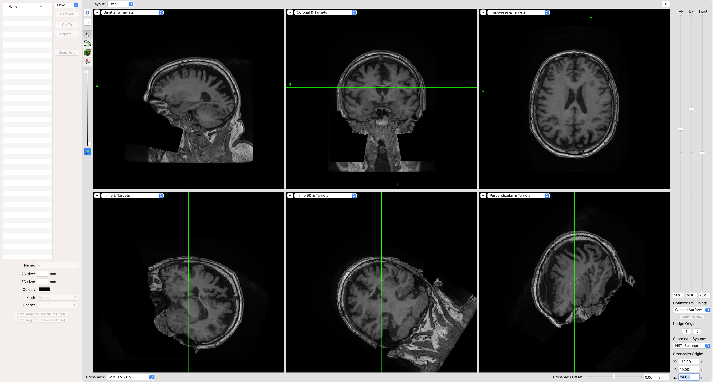
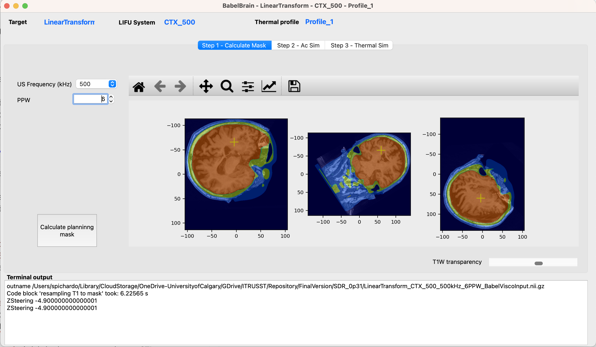
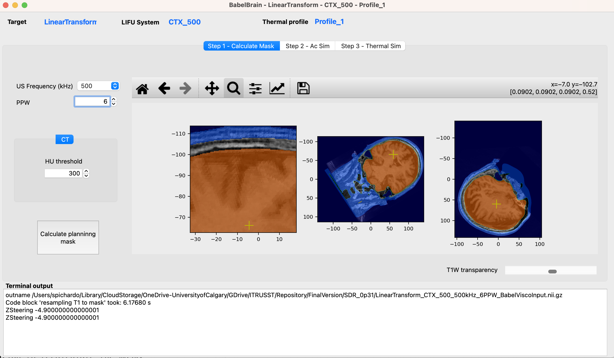
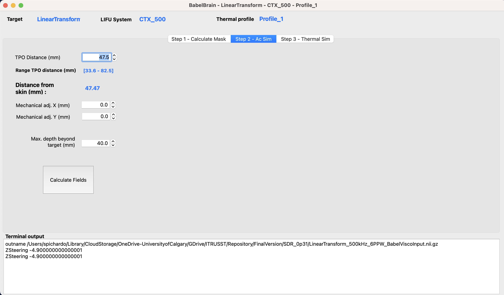
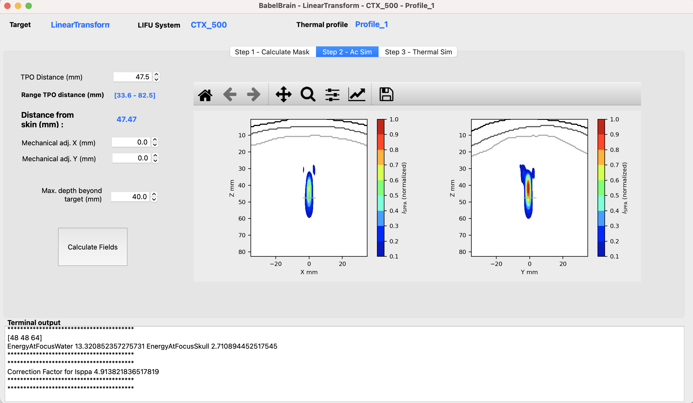

# Pipeline description
BabelBrain takes 3D imaging data (MRI and, if available, CT) along with a trajectory indicating the location and orientation of an ultrasound transducer to target a location in the brain.


Currently,  three types of transducers are supported:
* **Single**. This is a simple focusing single-element transducer. The user can specify diameter, focal length and a frequency between 100 kHz and 700 kHz.
* **H317**. This is a 128-element phased array with a focal length of 135 mm and F#=0.9. The device is capable to operate at 250 kHz and 700 kHz.
* **CTX_500**. This is a device commercialized by the company NeuroFUS that has 4 ring-elements, with a focal length of 63.2 mm and F# = 0.98, and operates at 500 kHz.

The specific capabilities of each transducer are considered during the simulations. 

## Preliminary steps
* **Mandatory**: Collect T1W and T2W imaging of a participant. Highly recommended to use 3D isotropic (1mm resolution) scans.
* **Mandatory**: Execute  SimNIBS 3.x `headreco` or SimNIBS 4.x `charm` processing tool:
    ```
    headreco all <ID> <Path to T1W Nifti file> <Path to T2W Nifti file>
    ```
    or
    ```
    charm <ID> <Path to T1W Nifti file> <Path to T2W Nifti file>
    ```

    `<ID>` is a string for identification. A subdirectory `m2m_<ID>` will be created. Take note of this directory, this will be referred as the **SimNIBS output** directory in the following of this manual. 
* **Mandatory**: Identify the coordinates where you want to focus ultrasound in T1W space. There are many tools (FSL, SPM12, etc) that can be used to convert from standarized space (e.g. MNI) to T1W space.
* *Optional*: CT scan of the participant. Depending on the study being conducted, counting with a CT scan improves the precision of the simulation. 
* *Optional*:: ZTE scan of the participant. A pseudo CT scan can be reconstructed using a Zero Echo Time MRI scan. Details on MRI scan parameters and methods for pseudo-CT reconstruction (using the "classical" approach) can be found in the work presented by [Miscouridou *et al.*](https://ieeexplore.ieee.org/document/9856605) (DOI: 10.1109/TUFFC.2022.3198522). The user needs only to provide the Nifti file of the ZTE scan. BabelBrain will do the transformation to pseudo CT as detailed in Miscouridou *et al.* A Nifti file with the pseudo CT will be generated.

### Important disclaimer on using exclusively T1W and T2W imaging vs. using CT/ZTE scans
If no CT or ZTE scans are available, a mask representing the skull bone will be generated from the `headreco` or `charm` tools output. Be sure of inspecting the generated mask Nifti  file to ensure the mask is correctly calculated. Our experience indicates that `charm` tool produces a better skull mask extraction. When using only T1W and T2W as inputs, BabelBrain uses a generic mask to represent the skull bone (including regions of trabecular and cortical bone). Average values of speed of sound and attenuation are assigned to these bone layers. Consult the appendix section for details on the values used.

If a CT or ZTE scan is provided, a mapping of density, speed of sound and attenuation will be produced. Consult the appendix section for details on the mapping procedure.

# Workflow
Once imaging data is ready, the simulation for transcranial ultrasound is done in 2 main steps: Planning and simulation
## Planning


The goal of the planning step is to produce a **trajectory** that provides the location where ultrasound is intended to be focused and the orientation of the transducer in T1W coordinate space. In practice, the trajectory is just an affine matrix applied to a "virtual" needle that describes the **location** and **orientation** where focused ultrasound is desired to be concentrated. The tip of the trajectory needs to be at the intended target. The position of the transducer will be relative to the tip location. The details using 3DSlicer can illustrate this.

#### Acoustic path STL helpers
BabelBrain includes a series of complementary STL files representing the "acoustic" path. Each STL file includes a group of circular meshes combined with a target needle that represent the acoustic cross sections of a field produced with a transducer with F#=1.0 at different depths. As noted in the instructions below, these meshes help to verify a correct alignment with the skin.

### Planning with 3DSlicer
1. Install the **SlicerIGT** extension in 3DSlicer (restart 3DSlicer if requested)
1. Load T1W planning data

2. In the IGT extension menu, select "Create Models"

2. Load one of the STL helpers as a `model` with `RAS` coordinate convention. The model will appear by default centred in the T1W space and pointing in the inferior$\rightarrow$superior direction

Alternatively, you can create a needle with a length of 100 mm. 


1. Select the model in the data panel and edit the properties to make it appear in the "Slice Display"

1. Create a new transform and give it a name related to the target (e.g. LGPI, RSTN, LVIM, RM1, etc.). This is important as BabelBrain will use the name of the transform as a prefix for its output files.

Apply the transform to the  model and be sure the transformation is set to `local` (little button next to the "invert" button)

2. Select "Volume Reslice Driver" in the IGT module menu

2. Select the linear transform in the two first slice views

3. Select one view to be "Inplane" and the other to be "Inplane 90"

3. In the Data panel, select the linear transform and edit properties, you should be able to see the slice views aligned along the model 

3. Adjust the location of the tip of the needle using the **translation** (LR, PA, IS) controls to match the tip of the model to your area of interest.

3. Adjust the rotation of the model (it will rotate around the tip) using the **rotation** (LR, PA, IS) controls until finding a trajectory that has a clear path and mimics how the transducer will be placed. Tip: Adjust the trajectory to make it orthogonal to the skin surface in the inline and inline90 views; this recreates the condition of placing a transducer aligned relative to the skin.

Note: If you navigate to other windows in 3DSlicer, the transition and rotation control may set back to 0s. But the transformation matrix will remain with the latest values applied. Any other adjustment will be added to the transformation matrix. Be sure that the `local` option is always selected.
4. Save transformation in text format. Select "Save data" and select text format for the transform. Take note of the path. Suggestion: Select a directory in the same path where T1W or SimNIBS output is located. 

### Planning with Brainsight
Brainsight is a proprietary software by Rogue Research (Montreal, Canada) for the planning and execution of non-invasive neuromodulation. This software has an existing feature that exports a trajectory that can be used in BabelBrain. The workflow to export a trajectory is very similar to 3DSlicer.
1. Create a new "empty" or "SimNIBS" project; use SimNIBS only if you used SimNIBS 3.x with `headreco`.

1. Load T1W planning data.  If using  "SimNIBS" project, it will preload the T1W imaging dataset.

2. Open target window

3. Adjust coordinates and orientation with control in the user interface (right side of screen)

3. Create a new target as a trajectory

3. Rename the trajectory with a name related to the target (e.g. LGPI, RSTN, LVIM, RM1, etc.)
4. Export trajectory with "Export" function and select "Orientation (3 directions vectors)" and "NifTI:Scanner" as the coordinate system. Take note of the path. Suggestion: Select a directory in the same path where T1W or SimNIBS output is located. 


## Simulation with BabelBrain
Now that planning is done, open BabelBrain either from the Applications menu in macOS if the DMG installer was used or with `python BabelBrain.py` as indicated in the installation section.


### Input data
An input dialog will prompt the different input files required for the simulation.


1. Specify the path to the trajectory file and the source (Slicer or Brainsight)
2. Select the SimNIBS output directory associated to this test and indicate what tool was used to generate it (`headreco` or `charm`)
3. Select the path to the T1W Nifti file
4. Indicate if CT scan is available. Options are "No", "real CT" or "ZTE". Select if coregistration of CT to T1W space must be performed. Depending on your specific preliminary steps, you may have CT already coregistered in T1W space. If coregistration is done by BabelBrain, the resolution of the CT will be preserved. The T1W file will be first bias-corrected and upscaled to the CT resolution and then the CT will be coregistered using the `itk-elastix` package with rigid coregistration.
5. Select a thermal profile file for simulation. This is a simple YAML file where the timings of transcranial ultrasound are specified. For example:
    ```YAML
    BaseIsppa: 5.0 # W/cm2
    AllDC_PRF_Duration: #All combinations of timing that will be considered
        -   DC: 0.3
            PRF: 10.0
            Duration: 40.0
            DurationOff: 40.0
    ```
    This definition helps in the step of thermal simulation with BabelBrain. `BaseIsspa` is the reference value of acoustic intensity for which the thermal equation will be solved. You can set this to 5 W/cm$^2$. Choices for other powers will be scaled (no recalculations) based on this value.

    More than one exposure can be specified. For example:
    ```YAML
    BaseIsppa: 5.0 # W/cm2
    AllDC_PRF_Duration: #All combinations of timing that will be considered
        -   DC: 0.3
            PRF: 10.0
            Duration: 40.0
            DurationOff: 40.0
        -   DC: 0.1
            PRF: 5.0
            Duration: 80.0
            DurationOff: 50.0
    ```
    When running the thermal simulation step, all the combinations specified in the thermal profile will be calculated. 

6. Once all inputs are set, then click on "CONTINUE"
### Domain generation
The first step after specifying input data is to create the simulation domain. The available operating frequencies will depend on the selected transducer. The second main input is the resolution of the simulation expressed in the number of points per wavelength (PPW). The minimum for fast estimation is 6 PPW, and 9 PPW to meet criteria de convergence when compared to other [numerical tools](https://asa.scitation.org/doi/10.1121/10.0013426).
 Depending on if CT or ZTE scans are available, options to fine-tune the domain generation will be available. For CT scans, the user can adjust the threshold for bone detection (set by default to 300 HU). For ZTE scans the user can specify the thresholds to select normalized ZTE signal (by default 0.1 and 0.6) to convert to pseudo-CT. Please consult Miscouridou *et al.*](https://ieeexplore.ieee.org/document/9856605) for details on the "classical" approach to convert from ZTE to pseudo-CT.
 The execution time in M1 Max processor can take from 1 minute of minutes up to 10 minutes depending on the resolution and availability of ZTE/CT scans.
 When initiating the calculations, a detailed log output will appear in the bottom region of the window. In case of any error during processing, a dialog message will prompt indicating to consult this window for more details. Once executed, orthogonal views of the domain will be shown.

Once executed, a Nifti file containing the mask describing the different tissue regions will be produced in the directory where the T1W Nifit file is located. It will have a file with the following structure:
`<Name of target file>_<Frequency>_<PPW>_BabelViscoInput.nii.gz`, for example `LinearTransform_500kHz_6PPW_BabelViscoInput.nii.gz`. The mask will be in T1W space, facilitating its inspection as overlay with T1W data. The mask has values of 1 for skin, 2 for cortical bone, 3 for trabecular and 4 for brain tissue. A single voxel with a value of 5 indicates the location of the target. The raw data inside the Nifti file is organized in a 3D Cartesian volume that is aligned to the transducer acoustic axis. The Nifti affine matrix ensures the mask can be inspected in T1W space.

It is very important to inspect this file in tools such as Brainsight or 3DSlicer to ensure no over/under- estimation of the skull region has occurred.  

|  |
|:-:|
|*Inspection of mask generation in 3DSlicer*|

If a CT or ZTE dataset is indicated as input, the skull mask will be created using this scan than the output of headreco or charm. 

Please note if a `<Name of target file>_<Frequency>_<PPW>_BabelViscoInput.nii.gz` file exists, the GUI will ask confirmation to recalculate the mask. Selecting "No" will load the previous mask. 

If using output from `headreco`, the STL files for skin, csf and bone are used to produce the high-resolution mask via GPU-accelerated voxelization. 

If using output from `charm` (which does not produces STL files), equivalent STL files are produced from the file `final_tissues.nii.gz` created by charm. Meshes are created and smoothed (Laplace filtering), and the mask for simulation is calculated via GPU-accelerated voxelization. The STL files of skin, csf and bone will be saved in the output directory of SimNIBS by BabelBrain. 


### Transcranial ultrasound simulation
The second tab in the GUI of Babelbrain shows the ultrasound simulation step. The choices of this tab will depend on the selected transducer. Simulation results in this step are shown in normalized conditions. The final step (see below) later will show the results denormalized in function of the selected target intensity at the target.

### CTX_500
For the CTX_500 transducer, the initial assumption is that this type of transducer will be placed in direct contact with the skin and that the focusing distance will be adjusted according to the desired target. 


The initial "TPO Distance" (an adjustable parameter in the CTX_500 device) is calculated based on the distance skin to the target. 

It is recommended to simulate with the default values to evaluate the degree of focus shift caused by the skull. Simulation should take a couple of minutes in a M1 Max system.

|  |
|:-:|
|*Simulation results with default values*|

The results window will show two orthogonal views of normalized acoustic intensity. The intensity in the skin and skull regions is masked out (it can be visualized later in those regions in step 3). In this step, the main focus is to ensure a correct spatial focusing at the target. In the example, a shift of 5 mm of the focal spot towards the transducer can be observed. This shift can be corrected by adding 5 mm in the TPO Distance input (in the example, we adjust to 52.5 mm). Also, there is a small lateral shift in the negative "Y" direction. This can be corrected with the "Mechanical" adjustment controls (in this example we adjust +1mm in the Y direction). Please note that in the simulation domain, X, Y and Z are not mapped to subject coordinates. However, at the end of the simulations there will be a report in which direction in the T1W space this adjustment translates. 

After doing the adjustments, the simulation can be repeated.

|  |
|:-:|
|*Simulation results after correction*|

### H317
The H317 is a large transducer that uses a coupling cone that is in contact with the skin 
 


The initial "TPO Distance" (an adjustable parameter in the CTX_500 device) is calculated based on the distance skin to the target. 

It is recommended to simulate with the default values to evaluate the degree of focus shift caused by the skull. Simulation should take a couple of minutes in a M1 Max system.

|  |
|:-:|
|*Simulation results with default values*|

The results window will show two orthogonal views of normalized acoustic intensity. The intensity in the skin and skull regions is masked out (it can be visualized later in those regions in step 3). In this step, the main focus is to ensure a correct spatial focusing at the target. In the example, a shift of 5 mm of the focal spot towards the transducer can be observed. This shift can be corrected by adding 5 mm in the TPO Distance input (in the example, we adjust to 52.5 mm). Also, there is a small lateral shift in the negative "Y" direction. This can be corrected with the "Mechanical" adjustment controls (in this example we adjust +1mm in the Y direction). Please note that in the simulation domain, X, Y and Z are not mapped to subject coordinates. However, at the end of the simulations there will be a report in which direction in the T1W space this adjustment translates. 

After doing the adjustments, the simulation can be repeated.

|  |
|:-:|
|*Simulation results after correction*|